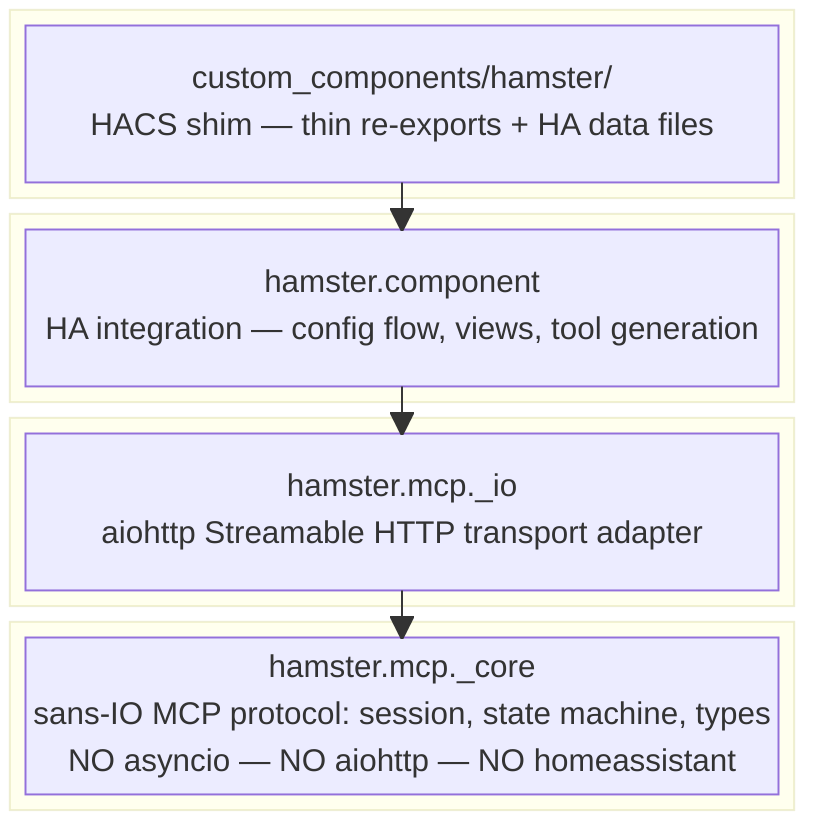

# Architecture

## Layer Design



See [Data Flow](data-flow.md) for sequence diagrams showing how MCP requests
flow through each layer.

## Package Layout

```text
hamster/
├── src/
│   └── hamster/
│       ├── __init__.py
│       ├── mcp/                          # MCP protocol submodule
│       │   ├── __init__.py               # Public API re-exports
│       │   ├── _core/                    # Sans-IO protocol core
│       │   │   ├── __init__.py
│       │   │   ├── events.py             # Effect/event types
│       │   │   ├── session.py            # Server session + state machine
│       │   │   ├── jsonrpc.py            # JSON-RPC 2.0 parsing/building
│       │   │   └── types.py              # MCP data types (Tool, Content, etc.)
│       │   ├── _io/                      # I/O adapters
│       │   │   ├── __init__.py
│       │   │   └── aiohttp.py            # aiohttp Streamable HTTP transport
│       │   └── _tests/
│       │       └── ...
│       └── component/                    # HA custom component
│           ├── __init__.py               # async_setup_entry, async_unload_entry
│           ├── config_flow.py            # Config + options flows
│           ├── const.py                  # DOMAIN, defaults
│           ├── http.py                   # HomeAssistantView wiring
│           ├── tools.py                  # HA services → MCP tools
│           └── _tests/
│               └── ...
├── custom_components/
│   └── hamster/                          # HACS deployment shim
│       ├── __init__.py                   # Re-exports from hamster.component
│       ├── config_flow.py                # Re-exports
│       ├── manifest.json
│       ├── strings.json
│       └── translations/en.json
├── docs/
│   ├── mkdocs.yml
│   └── src/
├── hacs.json
├── brand/icon.png
├── pyproject.toml
├── mise.toml
├── .pre-commit-config.yaml
├── AGENTS.md
├── README.md
├── LICENSE-MIT
└── LICENSE-APACHE
```

## Module Descriptions

| Module | Layer | Purpose |
| --- | --- | --- |
| `hamster.mcp._core.types` | Core | MCP data types: `Tool`, `Content`, `ServerInfo`, `ServerCapabilities` |
| `hamster.mcp._core.jsonrpc` | Core | JSON-RPC 2.0 message parsing and response building |
| `hamster.mcp._core.events` | Core | Inbound event types (`InitializeRequested`, `ToolCallRequested`, etc.) |
| `hamster.mcp._core.session` | Core | `MCPServerSession` --- sans-IO session with state machine |
| `hamster.mcp._io.aiohttp` | Integration | `AiohttpMCPTransport` --- bridges aiohttp requests to `MCPServerSession` |
| `hamster.component` | Application | HA integration entry point (`async_setup_entry`, `async_unload_entry`) |
| `hamster.component.config_flow` | Application | Config flow (setup) + options flow (tristate control) |
| `hamster.component.http` | Application | `HamsterMCPView` --- `HomeAssistantView` subclass, wires transport + HA auth |
| `hamster.component.tools` | Application | Pure function: HA service schemas to MCP tool definitions |
| `hamster.component.const` | Application | Domain constant, defaults |
| `custom_components/hamster/` | Deployment | HACS shim --- thin re-exports so HA can discover the integration |

## Distribution

The project produces two artifacts from a single repository:

| Artifact | Mechanism | Contains |
| --- | --- | --- |
| `hamster` on PyPI | `pip install hamster` | `hamster.mcp` + `hamster.component` (the library) |
| `custom_components/hamster/` via HACS | HACS git clone | Thin shim files + `manifest.json` + UI strings |

The `manifest.json` declares `"requirements": ["hamster>=0.1.0"]`, so when HA
loads the custom component it automatically pip-installs the library.

## Why a Custom Component

The decision to build as a custom component (not an external server or add-on)
was driven by one critical capability: only code running inside HA can access
`hass.services.async_services()`, which returns service schemas with field
definitions.

The external REST API (`/api/services`) lists services but does **not** include
schemas.
The WebSocket API may include some schema info but is less complete.

Additional benefits:

- Built-in HA auth via `requires_auth=True` on `HomeAssistantView`
- Direct access to entity/device/area registries
- Access to `async_should_expose()` for respecting HA's entity exposure settings
- Single deployment (no separate server process)
- No network hop for API calls

Trade-offs accepted:

- HA restart required for code changes (slower dev iteration)
- Must use HA's Python version and not conflict with HA's pinned dependencies
- Runs in HA's event loop (bugs could impact HA stability)

## Existing HA MCP Landscape

| Project | Type | Tools | Discovery | Auth |
| --- | --- | --- | --- | --- |
| `mcp_server` (official) | Core component | ~20 | Dynamic via intents | OAuth |
| `ha-mcp` (community) | Standalone/add-on | 95+ | Static | Token |
| `hass-mcp-server` (ganhammar) | Custom component | 21 | Static | OAuth |
| `mcp-assist` | Custom component | 11 | Index pattern | IP whitelist |
| **Hamster** | Custom component | All HA services | **Dynamic from schemas** | HA built-in |

Hamster's unique position: dynamic tool generation from service schemas, built-in
HA auth, full admin access, tristate tool control.
No existing project combines all of these.
