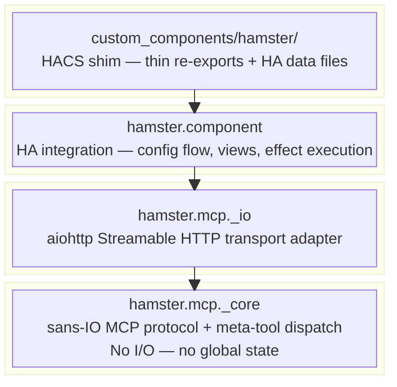
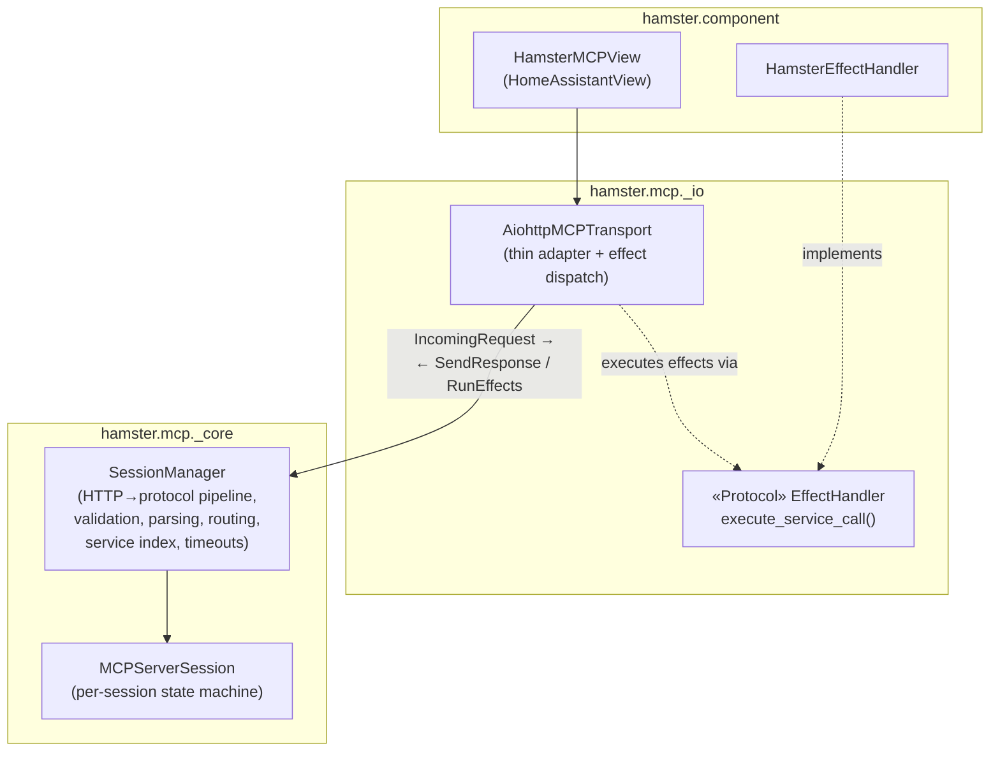
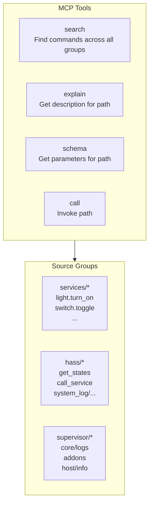
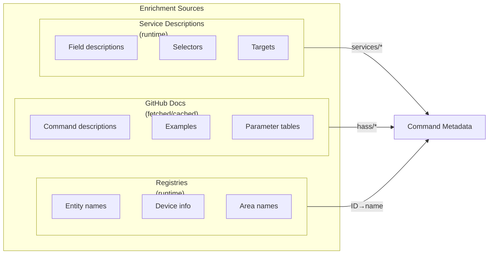

# Architecture

## Layer Design



See [Data Flow](data-flow.md) for sequence diagrams showing how MCP requests
flow through each layer.

## Package Layout

```text
hamster/
├── src/
│   └── hamster/
│       ├── __init__.py
│       ├── mcp/                          # MCP protocol submodule
│       │   ├── __init__.py               # Public API re-exports
│       │   ├── _core/                    # Sans-IO protocol core
│       │   │   ├── __init__.py
│       │   │   ├── events.py             # Protocol events + tool effect/continuation types
│       │   │   ├── session.py            # SessionManager + MCPServerSession
│       │   │   ├── jsonrpc.py            # JSON-RPC 2.0 parsing/building
│       │   │   ├── tools.py              # Meta-tools, ServiceIndex, call_tool(), resume()
│       │   │   └── types.py              # MCP data types (Tool, Content, etc.)
│       │   ├── _io/                      # I/O adapters
│       │   │   ├── __init__.py
│       │   │   └── aiohttp.py            # aiohttp Streamable HTTP transport
│       │   └── _tests/
│       │       └── ...
│       └── component/                    # HA custom component
│           ├── __init__.py               # async_setup_entry, async_unload_entry
│           ├── config_flow.py            # Config + options flows
│           ├── const.py                  # DOMAIN, defaults
│           ├── http.py                   # HomeAssistantView + HamsterEffectHandler
│           └── _tests/
│               └── ...
├── custom_components/
│   └── hamster/                          # HACS deployment shim
│       ├── __init__.py                   # Re-exports from hamster.component
│       ├── config_flow.py                # Re-exports
│       ├── brand/
│       │   └── icon.png
│       ├── manifest.json
│       ├── strings.json
│       └── translations/en.json
├── docs/
│   ├── mkdocs.yml
│   └── src/
├── hacs.json
├── pyproject.toml
├── mise.toml
├── .pre-commit-config.yaml
├── AGENTS.md
├── README.md
├── LICENSE-MIT
└── LICENSE-APACHE
```

## Module Descriptions

| Module | Layer | Purpose |
| --- | --- | --- |
| `hamster.mcp._core.types` | Core | MCP data types: `Tool`, `Content`, `ServerInfo`, `ServerCapabilities`, `IncomingRequest` |
| `hamster.mcp._core.jsonrpc` | Core | JSON-RPC 2.0 message parsing and response building |
| `hamster.mcp._core.events` | Core | `ReceiveResult` types (`SendResponse`, `RunEffects`) and tool effect/continuation types (`Done`, `ServiceCall`, `FormatServiceResponse`) |
| `hamster.mcp._core.session` | Core | `SessionManager` --- HTTP-to-protocol pipeline; validates headers, parses JSON/JSON-RPC, routes by session ID, creates sessions via injected `session_id_factory`, tracks timeouts, builds responses. `MCPServerSession` --- per-session sans-IO state machine. |
| `hamster.mcp._core.tools` | Core | 4 fixed meta-tool definitions (`TOOLS`), `ServiceIndex`, `call_tool()`, `resume()`, selector descriptions |
| `hamster.mcp._io.aiohttp` | Integration | `AiohttpMCPTransport` --- thin adapter; extracts headers/body from aiohttp, delegates to `SessionManager`, runs effect dispatch loop. Timeout wakeup loop. `EffectHandler` protocol definition. |
| `hamster.component` | Application | HA integration entry point (`async_setup_entry`, `async_unload_entry`) |
| `hamster.component.config_flow` | Application | Config flow (setup) + options flow (tristate control) |
| `hamster.component.http` | Application | `HamsterMCPView` --- `HomeAssistantView` subclass, wires transport + HA auth. `HamsterEffectHandler` --- implements `EffectHandler`, executes `hass.services.async_call()`. |
| `hamster.component.const` | Application | Domain constant, defaults |
| `custom_components/hamster/` | Deployment | HACS shim --- thin re-exports so HA can discover the integration |

## Core API: `ReceiveResult`

`SessionManager.receive_request()` takes an `IncomingRequest` (raw HTTP
data) and returns a `ReceiveResult` telling the transport exactly what to
send back.  The sans-IO boundary sits at raw HTTP: the transport extracts
header strings and body bytes from the framework, the core handles
everything else.

```python
# _core.types
@dataclass(frozen=True)
class IncomingRequest:
    """Framework-agnostic HTTP request data."""
    http_method: str
    content_type: str | None
    accept: str | None
    origin: str | None
    host: str                # from Host header
    session_id: str | None   # from Mcp-Session-Id header
    body: bytes

# _core.events
@dataclass(frozen=True)
class SendResponse:
    """Complete HTTP response instruction."""
    status: int
    headers: dict[str, str]
    body: dict[str, object] | None  # JSON body, or None for no-body

@dataclass(frozen=True)
class RunEffects:
    """Tool call needs I/O. Transport runs effects, then calls back."""
    request_id: JsonRpcId
    effect: ToolEffect

ReceiveResult = SendResponse | RunEffects
```

The transport dispatch is a two-arm match/case:

- `SendResponse` --- translate directly to an HTTP response.
- `RunEffects` --- execute the effect dispatch loop, then call
  `manager.build_effect_response()` to get a `SendResponse`.

See [Data Flow](data-flow.md) for the full sequence diagrams.

## Effect Handler Protocol

The only I/O the transport cannot perform itself is executing HA service
calls.
The `EffectHandler` protocol defines this narrow boundary.
The transport is HA-independent for testability; the component provides the
implementation.



Defined in `hamster.mcp._io`, implemented by `hamster.component`:

```python
class EffectHandler(Protocol):
    async def execute_service_call(
        self,
        domain: str,
        service: str,
        target: dict[str, object] | None,
        data: dict[str, object],
    ) -> ServiceCallResult: ...
```

### Responsibility Split

| Concern | Owner | Layer |
| --- | --- | --- |
| Read body bytes, extract header strings | Transport | `_io` |
| Build `IncomingRequest` | Transport | `_io` |
| Translate `SendResponse` to framework response | Transport | `_io` |
| Effect dispatch loop | Transport | `_io` |
| Timeout wakeup loop | Transport | `_io` |
| HTTP header validation | SessionManager | `_core` |
| JSON body parsing | SessionManager | `_core` |
| HTTP response building (status, headers, body) | SessionManager | `_core` |
| JSON-RPC parsing + response building | SessionManager | `_core` |
| Session state machine | MCPServerSession | `_core` |
| Session routing + creation | SessionManager | `_core` |
| Session timeout tracking | SessionManager | `_core` |
| Tool list (constant) + service index | SessionManager | `_core` |
| `call_tool()` / `resume()` | `_core.tools` | `_core` |
| HA service call execution | **EffectHandler** | `component` |
| Service index rebuild trigger | Component | `component` |

### Error Handling Layers

All errors except I/O failures are handled in the sans-IO core:

| Error | Who handles | Result |
| --- | --- | --- |
| Bad headers (Content-Type, Accept, Origin) | **SessionManager** | `SendResponse(415)`, `SendResponse(406)`, `SendResponse(403)` |
| Malformed JSON body | **SessionManager** | `SendResponse(400)` with `PARSE_ERROR` |
| Invalid JSON-RPC structure | **SessionManager** | `SendResponse(400)` with `-32600` |
| Unknown session ID | **SessionManager** | `SendResponse(404)` |
| Missing session ID after init | **SessionManager** | `SendResponse(400)` |
| Wrong state, unknown method | **MCPServerSession** | Error result (manager wraps into `SendResponse`) |
| HA service call exception | **EffectHandler** | `ServiceCallResult` with error; `resume()` produces `Done(CallToolResult(is_error=True))` |

Protocol errors never escape the core.
Application errors never escape the handler.
The transport just does match/case on `SendResponse` vs `RunEffects`.

## Distribution

The project produces two artifacts from a single repository:

| Artifact | Mechanism | Contains |
| --- | --- | --- |
| `hamster` on PyPI | `pip install hamster` | `hamster.mcp` + `hamster.component` (the library) |
| `custom_components/hamster/` via HACS | HACS git clone | Thin shim files + `manifest.json` + UI strings |

The `manifest.json` declares `"requirements": ["hamster>=0.1.0"]`, so when HA
loads the custom component it automatically pip-installs the library.

## Why a Custom Component

The decision to build as a custom component (not an external server or add-on)
was driven by access to internal APIs unavailable to external clients:

- **`async_get_all_descriptions()`** --- returns service descriptions with
  field definitions, selectors, and target configuration.  The external REST
  API (`/api/services`) lists services but does **not** include field schemas.
- **`hass.data["websocket_api"]`** --- the WebSocket command registry with
  handler functions and voluptuous schemas.  External clients can only invoke
  commands, not discover their schemas programmatically.
- **Supervisor client** --- direct access to the Supervisor API for logs,
  add-on management, and host info on HA OS / Supervised installs.

Additional benefits:

- Built-in HA auth via `requires_auth=True` on `HomeAssistantView`
- Direct access to entity/device/area registries
- Access to `async_should_expose()` for respecting HA's entity exposure settings
- Single deployment (no separate server process)
- No network hop for API calls

Trade-offs accepted:

- HA restart required for code changes (slower dev iteration)
- Must use HA's Python version and not conflict with HA's pinned dependencies
- Runs in HA's event loop (bugs could impact HA stability)

## Existing HA MCP Landscape

| Project | Type | Tools | Discovery | Auth |
| --- | --- | --- | --- | --- |
| `mcp_server` (official) | Core component | ~20 | Dynamic via intents | OAuth |
| `ha-mcp` (community) | Standalone/add-on | 95+ | Static | Token |
| `hass-mcp-server` (ganhammar) | Custom component | 21 | Static | OAuth |
| `mcp-assist` | Custom component | 11 | Index pattern | IP whitelist |
| **Hamster** | Custom component | 4 meta-tools | **Dynamic multi-source discovery** | HA built-in |

Hamster's unique position: meta-tool API gateway pattern (search/explain/call/schema)
giving access to HA services, WebSocket commands, and Supervisor APIs via 4 fixed
tools.  Built-in HA auth, full admin access.  No existing project uses this approach.

## Multi-Source Architecture

Hamster exposes HA capabilities through three distinct source groups, each with
its own discovery mechanism and metadata enrichment.  See
[D024](decisions.md#d024-multi-source-architecture) for design rationale.



### Source Groups

| Group | Source | Discovery | Enrichment |
| --- | --- | --- | --- |
| `services` | HA service registry | `hass.services.async_services()` | `async_get_all_descriptions()` (runtime) |
| `hass` | WebSocket command registry | `hass.data["websocket_api"]` | GitHub docs (user-triggered fetch) |
| `supervisor` | Supervisor client | Discovered via `hass` initially | TBD |

### Path Format

Commands are identified by `<group>/<path>`:

| Full Path | Group | In-Group Path |
| --- | --- | --- |
| `services/light.turn_on` | services | `light.turn_on` |
| `hass/get_states` | hass | `get_states` |
| `hass/config/entity_registry/list` | hass | `config/entity_registry/list` |
| `supervisor/core/logs` | supervisor | `core/logs` |

### Why Three Groups

**Services (`services/*`):** HA's service registry provides the richest
metadata via `async_get_all_descriptions()` --- field descriptions, selectors,
target configuration.  This is the primary interface for actions (turning
things on/off, triggering automations).

**WebSocket Commands (`hass/*`):** HA's WebSocket API covers queries that
services don't expose --- entity states, registries, history, system logs,
config entries.  Commands are discoverable at runtime via
`hass.data["websocket_api"]`.  However, HA maintainers have intentionally
kept WebSocket APIs undocumented to preserve flexibility, so metadata is
sparser than services.

**Supervisor (`supervisor/*`):** The Supervisor runs as a separate process and
provides capabilities unavailable through HA's internal APIs --- full logs
(not just the in-memory `system_log` buffer), add-on management, backups,
host info.  Only available on HA OS / Supervised installs.

### Enrichment Sources

Metadata comes from multiple sources, layered by availability:



**Service descriptions** are fetched at runtime via
`async_get_all_descriptions()`.  This is the richest metadata source.

**GitHub docs** are fetched from the `master` branch of
`home-assistant/developers.home-assistant` on user request.  The docs repo
is separate from `home-assistant/core` and has no version tags, so
version matching is approximate.  If docs are unavailable (not yet fetched,
or fetch failed), commands in the `hass` group report "description
unavailable" but remain callable --- the schema is always available from
the voluptuous definitions in `hass.data["websocket_api"]`.

**Registries** (entity, device, area, floor, label) provide human-readable
names for IDs.  These are used to enrich command outputs, not command
descriptions.

### Filtering

Commands are exposed with minimal filtering:

- **Excluded:** Subscription commands (`subscribe_*`, `unsubscribe_*`) ---
  wrong interaction model for MCP request/response
- **Excluded:** Auth commands (`auth`) --- handled at connection level
- **Included:** Everything else, including "admin" operations like logs,
  config introspection, registry mutations

User configurability of command exposure is deferred to the config UX
design phase.

### Supervisor Availability

The `supervisor` group is only available on HA OS and Supervised installs.
When unavailable:

- Supervisor commands don't appear in search results
- Attempts to describe/execute supervisor commands return clear errors
- Detection is via environment variables (`SUPERVISOR`, `SUPERVISOR_TOKEN`)
  and the presence of the `hassio` integration
