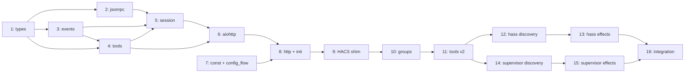
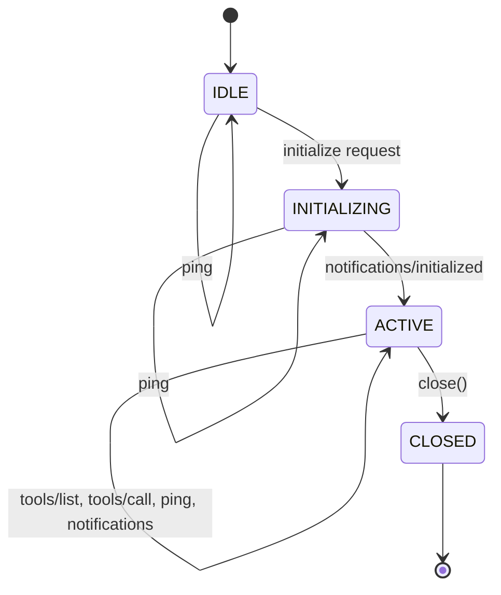
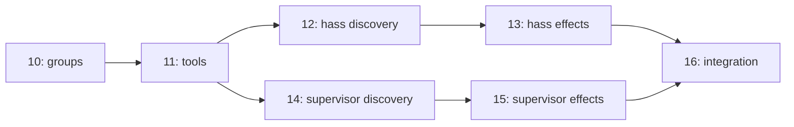

# Implementation Plan

Staged bottom-up implementation following the dependency graph through the
four layers: Core, Integration, Application, Deployment.

## Overview

| Stage | Module(s) | Layer | Deliverable |
| --- | --- | --- | --- |
| **1** | `_core/types.py` | Core | MCP data types, `IncomingRequest` |
| **2** | `_core/jsonrpc.py` | Core | JSON-RPC 2.0 parsing and response building |
| **3** | `_core/events.py` | Core | `SendResponse`/`RunEffects` result types, tool effect/continuation types |
| **4** | `_core/tools.py` | Core | Tool generation, `call_tool()`, `resume()` |
| **5** | `_core/session.py` | Core | `SessionManager` (HTTP-to-protocol pipeline) + `MCPServerSession` state machine |
| **6** | `_io/aiohttp.py` | Integration | Thin aiohttp adapter, `EffectHandler` protocol, effect dispatch loop |
| **7** | `component/const.py`, `component/config_flow.py` | Application | Domain constant, config flow, test infra |
| **8** | `component/http.py`, `component/__init__.py` | Application | HTTP view, effect handler, entry points |
| **9** | `custom_components/hamster/` | Deployment | Activate HACS shim re-exports |
| **10** | `_core/groups.py` | Core | `SourceGroup` protocol, `GroupRegistry`, refactor `ServicesGroup` |
| **11** | `_core/tools.py` | Core | Renamed tools (`hamster_*`), path-based dispatch |
| **12** | `_core/hass_group.py` | Core | `HassGroup`, WebSocket command discovery |
| **13** | `_core/events.py`, `_io/aiohttp.py`, `component/http.py` | Core/Integration/Application | `HassCommand` effect, handler implementation |
| **14** | `_core/supervisor_group.py` | Core | `SupervisorGroup`, endpoint definitions, availability detection |
| **15** | `_core/events.py`, `_io/aiohttp.py`, `component/http.py` | Core/Integration/Application | `SupervisorCall` effect, handler implementation |
| **16** | `component/__init__.py` | Application | Wire all groups, integration tests |

Stages 1--5 are pure Python (no mocks, no event loops).
Stage 6 needs asyncio/aiohttp but no HA.
Stages 7--8 need `pytest-homeassistant-custom-component`.
Stages 10--16 extend the architecture to support multiple source groups.



---

## Stage 1 --- `_core/types.py`

MCP data types.  Frozen dataclasses with no behavior, no I/O, no
serialization logic.

### Types

**`JsonRpcId`** --- type alias `int | float | str | None`.  JSON-RPC
allows integer, number, string, or null request IDs.  Fractional numbers
are discouraged (SHOULD NOT) but valid.  `None` represents a null ID
(used in error responses when the original ID could not be determined).

**`TextContent`** --- frozen dataclass.

| Field | Type |
| --- | --- |
| `text` | `str` |

No `type` field --- `isinstance()` discriminates.
The `"type": "text"` wire-format key is added by `jsonrpc.py`.

**`ImageContent`** --- frozen dataclass.

| Field | Type |
| --- | --- |
| `data` | `str` (base64-encoded) |
| `mime_type` | `str` |

**`Content`** --- type alias `TextContent | ImageContent`.
Intentionally incomplete --- MCP also defines `AudioContent` and
`EmbeddedResource` content types, deferred until needed (see Q014).
The implementation should include a comment on this union noting the
omission.

**`Tool`** --- frozen dataclass.

| Field | Type | Notes |
| --- | --- | --- |
| `name` | `str` | e.g. `hamster_services_search` |
| `description` | `str` | Tool description |
| `input_schema` | `dict[str, object]` | JSON Schema object |

**`CallToolResult`** --- frozen dataclass.

| Field | Type | Default |
| --- | --- | --- |
| `content` | `tuple[Content, ...]` | |
| `is_error` | `bool` | `False` |

`tuple` not `list` --- enforces immutability on a frozen dataclass.

**`ServerInfo`** --- frozen dataclass.

| Field | Type |
| --- | --- |
| `name` | `str` |
| `version` | `str` |

**`ToolsCapability`** --- frozen dataclass.

| Field | Type | Default |
| --- | --- | --- |
| `list_changed` | `bool` | `False` |

**`ServerCapabilities`** --- frozen dataclass.

| Field | Type | Default |
| --- | --- | --- |
| `tools` | `ToolsCapability \| None` | `ToolsCapability()` |

`tools=ToolsCapability()` means "we support tools, no `listChanged`".
`tools=ToolsCapability(list_changed=True)` advertises `listChanged`.
`tools=None` means "tools not supported".
`jsonrpc.py` handles serialization (see D020).

**`ServiceCallResult`** --- frozen dataclass.
Returned by `EffectHandler.execute_service_call()`, consumed by
`resume()`.

| Field | Type | Default |
| --- | --- | --- |
| `success` | `bool` | |
| `data` | `dict[str, object] \| None` | `None` |
| `error` | `str \| None` | `None` |

**`IncomingRequest`** --- frozen dataclass.
Framework-agnostic representation of an HTTP request.  The transport
extracts these fields from the framework's request object and passes
the struct to the sans-IO core, which handles all validation, parsing,
and routing.

| Field | Type | Notes |
| --- | --- | --- |
| `http_method` | `str` | `"POST"`, `"GET"`, or `"DELETE"` |
| `content_type` | `str \| None` | From `Content-Type` header |
| `accept` | `str \| None` | From `Accept` header |
| `origin` | `str \| None` | From `Origin` header |
| `host` | `str` | From `Host` header |
| `session_id` | `str \| None` | From `Mcp-Session-Id` header |
| `body` | `bytes` | Raw request body |
| `user_id` | `str \| None` | Authenticated user ID for authorization |

### Design decisions

- All frozen dataclasses --- immutable, inspectable, aligned with
  "effects are data" principle.
- Pythonic field names (`input_schema`, `is_error`, `mime_type`) ---
  `jsonrpc.py` handles camelCase conversion for wire format.
- No serialization methods --- wire format conversion lives in
  `jsonrpc.py`.
- `ImageContent` included now --- trivial, avoids a future union change.
- `IncomingRequest` pushes the sans-IO boundary out to raw HTTP data.
  The transport's only async job is reading the request body bytes;
  everything else (header validation, JSON parsing, JSON-RPC parsing,
  session routing, response building) lives in the pure core.

### Tests --- `_tests/test_types.py`

- Construction of each type with valid data.
- Immutability enforcement (assigning to fields raises
  `FrozenInstanceError`).
- `Content` union accepts both `TextContent` and `ImageContent`.
- `CallToolResult` defaults (`is_error=False`).
- `ToolsCapability` defaults (`list_changed=False`).
- `ServerCapabilities` defaults (`tools=ToolsCapability()`).
- `ServerCapabilities(tools=None)` for tools-not-supported case.
- `ServiceCallResult` construction for success and error cases.
- `IncomingRequest` construction with all fields (including `host`).

---

## Stage 2 --- `_core/jsonrpc.py`

JSON-RPC 2.0 message parsing and response building, including MCP type
serialization.

### Parsed message types

**`JsonRpcRequest`** --- frozen dataclass.

| Field | Type |
| --- | --- |
| `id` | `JsonRpcId` |
| `method` | `str` |
| `params` | `dict[str, object]` |

**`JsonRpcNotification`** --- frozen dataclass.

| Field | Type |
| --- | --- |
| `method` | `str` |
| `params` | `dict[str, object]` |

**`JsonRpcResponse`** --- frozen dataclass.
Received when a client sends a JSON-RPC response object (has `result` or
`error` instead of `method`).  Since the server never sends requests to
clients, these are unexpected.  Treated as `INVALID_REQUEST`.

| Field | Type |
| --- | --- |
| `response` | `dict[str, object]` (pre-built JSON-RPC error response) |

**`JsonRpcParseError`** --- frozen dataclass.

| Field | Type |
| --- | --- |
| `response` | `dict[str, object]` (pre-built JSON-RPC error response) |

**`ParsedMessage`** --- type alias
`JsonRpcRequest | JsonRpcNotification | JsonRpcResponse | JsonRpcParseError`.

### Constants

```python
PARSE_ERROR = -32700
INVALID_REQUEST = -32600
METHOD_NOT_FOUND = -32601
INVALID_PARAMS = -32602
INTERNAL_ERROR = -32603

SUPPORTED_VERSIONS: tuple[str, ...] = ("2025-03-26",)
MCP_PROTOCOL_VERSION = SUPPORTED_VERSIONS[0]
```

### Parsing

**`parse_message(raw: dict[str, object]) -> ParsedMessage`**

Parses a single JSON-RPC message object.

Validation rules:

- Has `result` or `error` key (no `method`) --- `JsonRpcResponse`
  (client sent a response object; rejected as `INVALID_REQUEST`).
- `jsonrpc` must be `"2.0"` --- `INVALID_REQUEST` if missing/wrong.
- `method` must be a string --- `INVALID_REQUEST` if missing/wrong type.
- `params` must be a dict if present --- `INVALID_REQUEST` if wrong type;
  defaults to `{}` if absent.  Note: JSON-RPC 2.0 allows array params,
  but MCP uses only object params; this parser is MCP-specific.
- `params: null` treated as `{}`.
- Has `id` (int, float, str, or null) --- `JsonRpcRequest`; no `id`
  key --- `JsonRpcNotification`.
- `id` with non-number/non-string type (bool, array, object) ---
  `JsonRpcParseError`.
- Error response `id` is `null` when original ID could not be extracted,
  otherwise carries the extracted ID.

**`parse_batch(body: object) -> list[ParsedMessage] | ParsedMessage`**

Handles the top-level JSON value after `json.loads`:

- If `body` is a dict --- delegate to `parse_message()`, return single
  result.
- If `body` is a list --- empty list is `JsonRpcParseError`
  (`INVALID_REQUEST`).  Non-empty list: call `parse_message()` on each
  element (non-dict elements produce `JsonRpcParseError` per element).
  Return list of results.
- Otherwise (string, number, null, bool) --- `JsonRpcParseError`
  (`INVALID_REQUEST`).

### Response building

**`make_success_response(request_id: JsonRpcId, result: object) -> dict`**
--- `{"jsonrpc": "2.0", "id": ..., "result": ...}`.

**`make_error_response(request_id: JsonRpcId | None, code: int, message: str) -> dict`**
--- `{"jsonrpc": "2.0", "id": ..., "error": {"code": ..., "message": ...}}`.

### MCP type serialization

| Function | Wire format |
| --- | --- |
| `serialize_tool(Tool)` | `{"name": ..., "description": ..., "inputSchema": ...}` |
| `serialize_content(Content)` | `{"type": "text", "text": ...}` or `{"type": "image", "data": ..., "mimeType": ...}` |
| `serialize_call_tool_result(CallToolResult)` | `{"content": [...]}` --- `"isError"` key omitted when false, included when true |
| `serialize_server_info(ServerInfo)` | `{"name": ..., "version": ...}` |
| `serialize_capabilities(ServerCapabilities)` | `{"tools": {}}` when `ToolsCapability(list_changed=False)`, `{"tools": {"listChanged": true}}` when `list_changed=True`, `{}` when `None` |

### MCP response builders

| Function | Purpose |
| --- | --- |
| `build_initialize_response(request_id, server_info, capabilities, protocol_version)` | Full init response with negotiated `protocolVersion` |
| `build_tool_list_response(request_id, tools: Sequence[Tool])` | Response with serialized tool array (no pagination --- all tools in one response; cursor support deferred) |
| `build_tool_result_response(request_id, result: CallToolResult)` | Response with serialized call tool result |

### Tests --- `_tests/test_jsonrpc.py`

**`parse_message` --- single messages:**

- Valid request with id, method, params --- `JsonRpcRequest`.
- Valid notification (no id) --- `JsonRpcNotification`.
- Response object (has `result`, no `method`) --- `JsonRpcResponse`.
- Missing `jsonrpc` / wrong version (`"1.0"`) / missing `method` /
  non-string method / array params / string params / bool id / object id
  / empty dict `{}` --- all `JsonRpcParseError`.
- Missing params defaults to `{}`.
- `params: null` treated as `{}`.
- Extra fields in message (e.g. `"extra": "bar"`) --- parsed
  successfully, extra fields ignored.
- Error response ID is `null` when original could not be extracted.

**`parse_message` --- id edge cases:**

- `id: 0` --- valid `JsonRpcRequest` (falsy but valid).
- `id: ""` --- valid `JsonRpcRequest` (empty string is valid).
- `id: null` --- valid `JsonRpcRequest` with `id=None`.
- `id: 1.5` --- valid `JsonRpcRequest` (fractional discouraged but
  allowed by spec).
- `id: -1` --- valid `JsonRpcRequest`.
- Very large integer --- valid `JsonRpcRequest`.

**`parse_batch` --- batch handling:**

- Single dict --- delegates to `parse_message`, returns single result.
- Array of valid requests --- returns list of `ParsedMessage`.
- Empty array `[]` --- `JsonRpcParseError` (`INVALID_REQUEST`).
- Array with non-dict element --- per-element `JsonRpcParseError`.
- Mixed array (requests + notifications) --- correct types per element.
- Non-dict non-array body (string, number, null, bool) ---
  `JsonRpcParseError`.

**Serialization:**

- `TextContent` --- `{"type": "text", "text": "..."}`.
- `ImageContent` --- `{"type": "image", "data": "...", "mimeType": "..."}`.
- `Tool` --- camelCase `inputSchema`.
- `CallToolResult(is_error=False)` --- `isError` key absent.
- `CallToolResult(is_error=True)` --- `"isError": true`.
- `ServerCapabilities(tools=ToolsCapability())` --- `{"tools": {}}`.
- `ServerCapabilities(tools=ToolsCapability(list_changed=True))` ---
  `{"tools": {"listChanged": true}}`.
- `ServerCapabilities(tools=None)` --- `{}`.

**MCP response builders:**

- Initialize response has `protocolVersion`, `capabilities`,
  `serverInfo`.
- Tool list response has `tools` array.
- Tool result response wraps `CallToolResult` correctly.

---

## Stage 3 --- `_core/events.py`

Protocol events and tool effect/continuation types.  These discriminated
unions drive the entire system.

### Group 1 --- Tool effect/continuation types

Used by `tools.py` --- `call_tool()` produces a `ToolEffect`, `resume()`
takes a `Continuation` and I/O result and produces the next `ToolEffect`.

**`FormatServiceResponse`** --- frozen dataclass, no fields.
Format the raw HA service response into MCP content.

**`Continuation`** --- type alias `FormatServiceResponse`.
Union grows as new continuation types are added.

**`Done`** --- frozen dataclass.

| Field | Type |
| --- | --- |
| `result` | `CallToolResult` |

**`ServiceCall`** --- frozen dataclass.

| Field | Type |
| --- | --- |
| `domain` | `str` |
| `service` | `str` |
| `target` | `dict[str, object] \| None` |
| `data` | `dict[str, object]` |
| `user_id` | `str \| None` |
| `continuation` | `Continuation` |

**`ToolEffect`** --- type alias `Done | ServiceCall`.

### Group 2 --- Request result types

Returned by `SessionManager.receive_request()`.  The transport does
`match`/`case` on these.  These tell the transport **what to do**, not
what happened --- the transport's match/case is trivial.

**`SendResponse`** --- frozen dataclass.

| Field | Type | Notes |
| --- | --- | --- |
| `status` | `int` | HTTP status code |
| `headers` | `dict[str, str]` | Response headers (e.g. `Mcp-Session-Id`, `Content-Type`) |
| `body` | `dict[str, object] \| None` | JSON-serializable body, or `None` for no-body responses |

Covers all non-effect responses: initialization (200 + `Mcp-Session-Id`
header), notification acknowledgment (202, no body), tool list (200),
HTTP-level errors (405 for unsupported GET/SSE, 406, 415, 503 for
unloaded), and JSON-RPC / protocol errors (400/404).  For JSON-RPC
errors, the body is a proper JSON-RPC error response object:
`{"jsonrpc": "2.0", "id": <id or null>, "error": {"code": ..., "message": ...}}`.

**`RunEffects`** --- frozen dataclass.

| Field | Type |
| --- | --- |
| `request_id` | `JsonRpcId` |
| `effect` | `ToolEffect` |

Returned for `tools/call`.  The transport runs the effect dispatch loop,
then calls `manager.build_effect_response(request_id, result)` to get a
`SendResponse`.

**`ReceiveResult`** --- type alias `SendResponse | RunEffects`.

### Group 3 --- Session lifecycle events

**`SessionExpired`** --- frozen dataclass.

| Field | Type |
| --- | --- |
| `session_id` | `str` |

### Definition order

`FormatServiceResponse` -> `Continuation` -> `Done`, `ServiceCall` ->
`ToolEffect` -> `SendResponse`, `RunEffects` -> `ReceiveResult` ->
`SessionExpired`.  Avoids forward references at runtime.

### Tests --- `_tests/test_events.py`

- Construction of each dataclass with required fields.
- `SessionExpired` construction with session_id string.
- `FormatServiceResponse` construction (no fields, just verifies it's
  instantiable).
- Type union membership (`isinstance` checks).
- Pattern matching on `ReceiveResult` covering `SendResponse` and
  `RunEffects`.
- Pattern matching on `ToolEffect` covering `Done` and `ServiceCall`.
- Nested dispatch: extract `effect` from `RunEffects`, match on it.
- `SendResponse` with `body=None` (e.g. 202) vs with body (e.g. 200).
- Frozen enforcement.

---

## Stage 4 --- `_core/tools.py`

Meta-tool definitions, `ServiceIndex`, `call_tool()`, and `resume()`.
Uses the "meta-tool" pattern (modeled after onshape-mcp): instead of
generating one MCP tool per HA service, 4 fixed tools let the LLM
discover and invoke any HA service dynamically (see D017).

### Fixed tool definitions

```python
TOOLS: tuple[Tool, ...] = (...)   # 4 constant Tool objects
```

| Tool name | Description |
| --- | --- |
| `hamster_services_search` | Find HA services by keyword, optionally filtered by domain |
| `hamster_services_explain` | Get full field/target/selector details for a specific service |
| `hamster_services_call` | Invoke a service with separate target and data parameters |
| `hamster_services_schema` | Describe what a selector type expects as input |

Input schemas:

**`hamster_services_search`:**

| Property | Type | Required |
| --- | --- | --- |
| `query` | `string` | yes |
| `domain` | `string` | no |

**`hamster_services_explain`:**

| Property | Type | Required |
| --- | --- | --- |
| `domain` | `string` | yes |
| `service` | `string` | yes |

**`hamster_services_call`:**

| Property | Type | Required |
| --- | --- | --- |
| `domain` | `string` | yes |
| `service` | `string` | yes |
| `target` | `object` (keys: `entity_id`, `device_id`, `area_id`, `floor_id`, `label_id` --- each `array` of `string`) | no |
| `data` | `object` | no |

**`hamster_services_schema`:**

| Property | Type | Required |
| --- | --- | --- |
| `selector_type` | `string` | yes |

### ServiceIndex

Searchable index of HA service descriptions.  Built from the output of
`homeassistant.helpers.service.async_get_all_descriptions()`.

```python
class ServiceIndex:
    def __init__(
        self,
        descriptions: dict[str, dict[str, object]],
    ) -> None: ...

    def search(
        self,
        query: str,
        *,
        domain: str | None = None,
    ) -> str: ...

    def explain(self, domain: str, service: str) -> str | None: ...
```

**Constructor:** iterates the descriptions dict (keyed by domain, then
service name).  Builds an internal list of entries with pre-computed
search text (domain, service name, description, field names
concatenated, lowercased).

**`search()`:** case-insensitive substring matching against the
pre-computed search text.  If `domain` is provided, only entries in that
domain are searched.  Returns a formatted text summary of matching
services.  Returns a "no results" message if nothing matches.

**Search result format:**

```text
Found 3 services matching "light":

1. **light.turn_on** - Turn on a light
2. **light.turn_off** - Turn off a light
3. **light.toggle** - Toggle a light on/off
```

With domain filter: `Found 2 services in domain 'switch' matching "toggle":`.
No results: `No services found matching "query".` (or with domain filter).

**`explain()`:** looks up a single service by domain and service name.
Returns the raw HA service description as formatted text: name,
description, target config (if any), and all fields with their selectors
as HA defines them (no translation).  Returns `None` if the service is
not found.

### Selector descriptions

```python
SELECTOR_DESCRIPTIONS: dict[str, str] = { ... }
```

Static mapping of selector type name to a human-readable description of
the expected input format.  Used by `hamster_services_schema`.

Examples:

| Selector type | Description (summary) |
| --- | --- |
| `boolean` | `true` or `false` |
| `text` | String value |
| `number` | Numeric value; may have min/max/step constraints |
| `select` | One of a fixed set of string options |
| `duration` | Dict with optional keys: `days`, `hours`, `minutes`, `seconds`, `milliseconds` (all numbers) |
| `color_rgb` | Array of 3 integers `[R, G, B]`, each 0--255 |
| `entity` | Entity ID string (e.g. `light.living_room`) |
| `target` | Dict with optional keys: `entity_id`, `device_id`, `area_id`, `floor_id`, `label_id` |
| `location` | Dict with `latitude`, `longitude` (required), `radius` (optional) |
| `object` | Arbitrary JSON object |
| Unknown | Description noting the selector type is unrecognized |

The full table covers all 40 registered HA selector types.

```python
def describe_selector(selector_type: str) -> str: ...
```

Looks up the selector type in `SELECTOR_DESCRIPTIONS`.  Returns the
description string, or a fallback message for unknown types.

### Tool dispatch

```python
def call_tool(
    name: str,
    arguments: dict[str, object],
    index: ServiceIndex,
    user_id: str | None,
) -> ToolEffect:
```

Dispatches by tool name:

- `hamster_services_search` --- calls `index.search()`, returns `Done`
  with text result.
- `hamster_services_explain` --- calls `index.explain()`, returns `Done`.
  Returns error content if service not found.
- `hamster_services_call` --- validates that the domain/service exists
  in the index (see D017).  If not found, returns
  `Done(CallToolResult(is_error=True))`.  If found, returns
  `ServiceCall(domain, service, target, data, user_id, FormatServiceResponse())`.
- `hamster_services_schema` --- calls `describe_selector()`, returns
  `Done`.
- Unknown name --- returns `Done(CallToolResult(is_error=True))` with
  error message (see D020).

Three of the four tools return `Done` immediately (pure computation).
Only `hamster_services_call` produces a `ServiceCall` effect requiring
I/O.

### Continuation

```python
def resume(continuation: Continuation, io_result: ServiceCallResult) -> ToolEffect:
```

`FormatServiceResponse` + `ServiceCallResult` ->
`Done(CallToolResult(...))`.  Formats success as JSON, formats error with
message and `is_error=True`.

### Tests --- `_tests/test_tools.py`

**Tool definitions:**

- `TOOLS` has exactly 4 entries.
- Each tool has a non-empty `name`, `description`, and valid
  `input_schema`.
- Tool names match `[a-zA-Z0-9_-]{1,64}`.

**ServiceIndex construction:**

- Empty descriptions dict -> empty index.
- Single domain/service -> searchable.
- Multiple domains -> all indexed.

**`search()`:**

- Keyword match on service name -> found.
- Keyword match on description -> found.
- Keyword match on field names -> found.
- Case-insensitive matching.
- Domain filter restricts results.
- No match -> "no results" message.
- Empty index + any query -> "no results" message.

**`explain()`:**

- Known service -> raw HA description with fields, selectors, target.
- Unknown service -> `None`.
- Empty index + any domain/service -> `None`.
- Service with sections (nested field groups) -> fields shown flattened.

**Selector descriptions:**

- Each known selector type returns a non-empty description.
- Unknown selector -> fallback message.

**`call_tool()`:**

- `hamster_services_search` -> `Done` with text content.
- `hamster_services_explain` -> `Done` with text content.
- `hamster_services_explain` for unknown service -> `Done` with
  `is_error=True`.
- `hamster_services_call` with valid service -> `ServiceCall` with
  correct domain, service, target, data.
- `hamster_services_call` with unknown service -> `Done` with
  `is_error=True`.
- `hamster_services_search` with empty index -> `Done` with "no results"
  text.
- `hamster_services_call` with empty index -> `Done` with
  `is_error=True` (service not in index).
- `hamster_services_schema` -> `Done` with selector description.
- Unknown tool name -> `Done` with `is_error=True`.

**Argument validation:**

- `hamster_services_search` with missing `query` -> `Done(is_error=True)`.
- `hamster_services_search` with `query` as integer -> `Done(is_error=True)`.
- `hamster_services_explain` with missing `domain` -> `Done(is_error=True)`.
- `hamster_services_explain` with missing `service` -> `Done(is_error=True)`.
- `hamster_services_call` with missing `domain` -> `Done(is_error=True)`.
- `hamster_services_call` with missing `service` -> `Done(is_error=True)`.
- `hamster_services_call` with missing `data` -> defaults to `{}`, succeeds.
- `hamster_services_call` with `data` as string -> `Done(is_error=True)`.
- `hamster_services_call` with `target` as string -> `Done(is_error=True)`.
- `hamster_services_schema` with missing `selector_type` -> `Done(is_error=True)`.

**`resume()`:**

- Success with data -> `Done` with JSON text.
- Success without data -> `Done` with success message.
- Error -> `Done` with `is_error=True`.

---

## Stage 5 --- `_core/session.py`

Session manager and per-session state machine.  The `SessionManager` is
the single entry point for the sans-IO core: it receives raw HTTP
request data (`IncomingRequest`) and returns a complete response
instruction (`ReceiveResult`).  Header validation, JSON parsing,
JSON-RPC parsing, session routing, and response building all live here.

### `MCPServerSession`

Per-session state machine.  Internal to the core --- not called directly
by the transport.  Only `SessionManager` interacts with sessions.



#### Internal result types

The session returns internal result types that the manager wraps into
`SendResponse` / `RunEffects` with appropriate HTTP status and headers.

**`SessionResponse`** --- frozen dataclass.

| Field | Type |
| --- | --- |
| `body` | `dict[str, object]` |

A JSON-RPC response body to send to the client.

**`SessionAck`** --- frozen dataclass, no fields.

A notification was processed.  Manager wraps as `SendResponse(202)`.

**`SessionToolCall`** --- frozen dataclass.

| Field | Type |
| --- | --- |
| `request_id` | `JsonRpcId` |
| `effect` | `ToolEffect` |

A tool call needs effect dispatch.  Manager wraps as `RunEffects`.

**`SessionError`** --- frozen dataclass.

| Field | Type |
| --- | --- |
| `code` | `int` |
| `message` | `str` |
| `request_id` | `JsonRpcId \| None` |

A JSON-RPC error.  Manager builds the error response and wraps as
`SendResponse(200)`.

**`SessionResult`** --- type alias
`SessionResponse | SessionAck | SessionToolCall | SessionError`.

#### API

```python
class MCPServerSession:
    def handle(
        self,
        message: JsonRpcRequest | JsonRpcNotification,
        index: ServiceIndex,
    ) -> SessionResult: ...
```

`handle()` is the single entry point.  The manager calls it after
parsing and routing, passing the current `ServiceIndex`.  The session
dispatches based on its current state and the message's method.  For
`tools/call`, the session passes the index through to `call_tool()`.

#### State routing

| State | Method | Result |
| --- | --- | --- |
| IDLE | `initialize` | -> INITIALIZING, `SessionResponse` with init body |
| IDLE | `ping` | `SessionResponse` with `{"result": {}}` |
| IDLE | anything else | `SessionError` (`INVALID_REQUEST`) |
| INITIALIZING | `notifications/initialized` | -> ACTIVE, `SessionAck` |
| INITIALIZING | `ping` | `SessionResponse` with `{"result": {}}` |
| INITIALIZING | anything else | `SessionError` (`INVALID_REQUEST`) |
| ACTIVE | `ping` | `SessionResponse` with `{"result": {}}` |
| ACTIVE | `tools/list` | `SessionResponse` with tool list body |
| ACTIVE | `tools/call` (valid tool name) | `SessionToolCall` with effect (index passed to `call_tool()`) |
| ACTIVE | `tools/call` (unknown tool name) | `SessionError` (`INVALID_PARAMS`) |
| ACTIVE | any notification | `SessionAck` |
| ACTIVE | unknown method request | `SessionError` (`METHOD_NOT_FOUND`) |
| CLOSED | anything | `SessionError` (`INVALID_REQUEST`) |

#### Version negotiation

On `initialize`, the session extracts `params["protocolVersion"]` from
the request.  If missing, returns `SessionError` (`INVALID_PARAMS`,
`"Missing protocolVersion"`).  The session checks the requested version
against `SUPPORTED_VERSIONS`:

- If found --- respond with that version.
- If not found --- respond with `MCP_PROTOCOL_VERSION` (the server's
  preferred version).  The client decides whether to continue.

The negotiated version is stored on the session (for future use) and
passed to `build_initialize_response()`.

### `SessionManager`

Multi-session container and HTTP-to-protocol pipeline.

```python
class SessionManager:
    def __init__(
        self,
        server_info: ServerInfo,
        idle_timeout: float = 1800.0,
        session_id_factory: Callable[[], str] = ...,
        debounce_delay: float = 0.5,
    ): ...
```

Default `session_id_factory` is `secrets.token_hex` (produces
cryptographically random hex strings).  Tests inject a deterministic
factory.  The manager validates that factory-produced IDs contain only
visible ASCII characters (0x21-0x7E) per MCP spec; invalid IDs raise
`ValueError` at session creation time.

Sessions are stored internally as `dict[str, MCPServerSession]` keyed
by session ID, with a parallel `dict[str, float]` for last-activity
timestamps.  The manager also holds a `ServiceIndex` (updated via
`update_index()`) and the constant `TOOLS` tuple from `tools.py`.

`SessionManager` is designed for single-event-loop concurrency.
Multiple coroutines may call `receive_request()` concurrently (asyncio
cooperative scheduling), but no thread safety is required.

**`WakeupToken`** --- type alias `object`.  Opaque token returned by
the core in `WakeupRequest`.  The I/O layer hands it back to the core
on wakeup without interpreting it.

**`WakeupRequest`** --- frozen dataclass.

| Field | Type |
| --- | --- |
| `deadline` | `float` |
| `token` | `WakeupToken` |

| Method | Signature | Purpose |
| --- | --- | --- |
| `update_index` | `(index: ServiceIndex) -> None` | Replace service index (tool list is constant; see D017) |
| `receive_request` | `(request: IncomingRequest, now: float) -> ReceiveResult \| list[ReceiveResult]` | Full HTTP-to-protocol pipeline; returns list for batch requests |
| `build_effect_response` | `(request_id: JsonRpcId, result: CallToolResult) -> SendResponse` | Build HTTP response after effect dispatch completes (session-independent) |
| `notify_services_changed` | `(now: float) -> None` | Record that services changed; starts debounce timer |
| `check_wakeups` | `(now: float) -> tuple[list[SessionExpired], bool, WakeupRequest \| None]` | Expire idle sessions, check index regeneration debounce, compute next wakeup |
| `handle_wakeup` | `(token: WakeupToken, now: float) -> None` | Core receives its own token back on wakeup (reserved for future use) |
| `close_session` | `(session_id: str) -> bool` | Explicitly close and remove a session from storage; subsequent requests with this session ID will get 404 |

**`receive_request()` logic:**

*Implementation note:* This method has multiple validation and routing
steps.  Consider extracting helper methods like `_validate_headers()`,
`_parse_json_rpc()`, `_route_to_session()` for readability.  This is
an implementation detail, not an API change.

1. Check `http_method`:
    - `GET` -> `SendResponse(405)`.  Intentionally unsupported in v1;
      GET becomes the SSE endpoint when streaming is added (see Q012).
    - `DELETE` -> extract session ID, close session,
      `SendResponse(200)` or `SendResponse(404)`.
    - `POST` -> continue below.
2. Validate `Content-Type` media type -> `SendResponse(415)` if not
   `application/json`.  Parameters (e.g. `; charset=utf-8`) are
   ignored; only the media type portion is checked.
3. Validate `Accept` header -> `SendResponse(406)` if not compatible
   with `application/json`.  Accepts `application/json`,
   `application/*`, `*/*`, and absent (`None`).  Missing `Accept` is
   treated as `*/*` for developer convenience (curl, testing tools).
   The MCP spec requires clients to send `Accept` but does not require
   servers to enforce it.  See Q011.
4. Validate `Origin` header (see D022).  If `Origin` is present, extract
   the host portion and compare to the `Host` header.  If they don't
   match, return `SendResponse(403)`.  If `Origin` is absent, allow
   (non-browser clients don't send it).
5. Parse JSON body (`json.loads`) -> `SendResponse(400)` with
   `PARSE_ERROR` on failure.
6. `parse_batch(body)` (JSON-RPC validation):
    - Single message: process as before.
    - Batch (list): process each message, collect results.  Omit
      responses for notifications.  If all messages are notifications,
      return `SendResponse(202)`.  Otherwise return list of response
      bodies as a JSON array.
    - `JsonRpcParseError` / `JsonRpcResponse` -> `SendResponse(400)`.
7. Route by `request.session_id`:
    - `None` + `initialize` -> create session via factory, delegate.
      `initialize` MUST NOT appear in a batch.
    - `None` + anything else -> `SendResponse(400)`.
    - Unknown session ID -> `SendResponse(404)`.
    - Known session ID -> update last-activity, delegate to session.
8. Wrap `SessionResult` into `SendResponse` or `RunEffects` with
   appropriate status, headers, and body.  The `Mcp-Session-Id` header
   is only included on the initialize response (per MCP spec); subsequent
   responses include only `Content-Type`.

**`build_effect_response()`:**

Session-independent.  Takes a `request_id` and `CallToolResult`, builds
the JSON-RPC response using `build_tool_result_response()`, and wraps in
`SendResponse(200)`.  Can be called even if the session has expired or
been closed --- the response is built without consulting session state.
Per MCP spec, the `Mcp-Session-Id` header is only required on the
initialize response; `build_effect_response()` does not include it.

**`check_wakeups()` logic:**

- Expire sessions where `now - last_activity >= idle_timeout`.
- Remove expired sessions from internal storage.
- Check if index regeneration debounce deadline has passed.
- Return `(expired_list, should_regenerate_index, next_wakeup)`.
- `next_wakeup` is `None` if no sessions and no pending debounce.

The I/O layer sleeps until the `WakeupRequest.deadline`, then calls
`check_wakeups()`.  When `should_regenerate_index` is `True`, the
component calls `async_get_all_descriptions()`, builds a new
`ServiceIndex`, and calls `update_index()`.  The generic
`WakeupRequest` / `WakeupToken` mechanism allows future wakeup reasons
without changing the I/O layer.

### Tests --- `_tests/test_session.py`

All tests use `IncomingRequest` values directly --- no HTTP framework,
no mocks.  The entire protocol is testable with plain data.

**Happy path:**

- Full flow: init -> ack -> tools/list -> tools/call (as raw
  `IncomingRequest` values with JSON bytes).

**HTTP-level validation:**

- Wrong `Content-Type` -> `SendResponse(415)`.
- `Content-Type` with parameters (e.g. `application/json; charset=utf-8`)
  -> accepted.
- `Accept` header absent (`accept=None`) -> accepted (treated as `*/*`).
- `Accept` header empty string (`accept=""`) -> `SendResponse(406)`.
- `Accept: text/html` (present but incompatible) -> `SendResponse(406)`.
- `Accept: application/json` -> accepted.
- `Accept: */*` -> accepted.
- `Accept: application/*` -> accepted.
- `Origin` absent -> accepted.
- `Origin` present, matches `Host` -> accepted.
- `Origin` present, does not match `Host` -> `SendResponse(403)`.
- `Origin` with port, `Host` with matching port -> accepted.
- Malformed JSON body -> `SendResponse(400)` with `PARSE_ERROR`.
- Empty body `b""` -> `SendResponse(400)` with `PARSE_ERROR`.
- Valid JSON that's not an object or array (e.g. `b'"hello"'`, `b"42"`)
  -> `SendResponse(400)` with `INVALID_REQUEST`.
- `GET` request -> `SendResponse(405)`.
- `DELETE` with valid session -> `SendResponse(200)`.
- `DELETE` with unknown session -> `SendResponse(404)`.
- `DELETE` with no session ID -> `SendResponse(400)`.

**Batch requests:**

- Array of two requests -> list of two responses.
- Array with mix of requests and notifications -> responses for requests
  only (notifications omitted).
- Array of only notifications -> `SendResponse(202)`.
- Empty array -> `SendResponse(400)` with `INVALID_REQUEST`.
- `initialize` in batch -> `SendResponse(400)`.

**State machine:**

- tools/list before init -> error response.
- initialize when active -> error response.
- Request to closed session -> error response.
- `ping` in IDLE -> success response `{"result": {}}`.
- `ping` in INITIALIZING -> success response `{"result": {}}`.
- `ping` in ACTIVE -> success response `{"result": {}}`.
- `ping` in CLOSED -> error response.

**Version negotiation:**

- `initialize` with matching `protocolVersion` -> response echoes same
  version.
- `initialize` with unknown `protocolVersion` -> response contains
  server's preferred version.
- `initialize` without `protocolVersion` -> error (`INVALID_PARAMS`).

**Routing:**

- No session ID + init -> creates session, `SendResponse(200)` with
  `Mcp-Session-Id` header.
- No session ID + non-init -> `SendResponse(400)`.
- Unknown session ID -> `SendResponse(404)`.
- Multiple independent sessions operate without interference.
- `Mcp-Session-Id` header is present only on initialize response, not on
  subsequent responses (tools/list, tools/call, etc.).

**Index and tool management:**

- `update_index()` replaces the service index.
- `tools/list` always returns the 4 fixed tools from `TOOLS`.
- Unknown tool name -> error response with `INVALID_PARAMS`.

**Tool call parameter validation:**

- `tools/call` with `params` missing `name` key -> `SessionError(INVALID_PARAMS)`.
- `tools/call` with `params` missing `arguments` key -> `SessionError(INVALID_PARAMS)`.
- `tools/call` with `params.name` as integer -> `SessionError(INVALID_PARAMS)`.
- `tools/call` with `params.arguments` as string -> `SessionError(INVALID_PARAMS)`.

**Programmatic session management:**

- `close_session(valid_id)` returns `True`, subsequent request with that
  ID -> `SendResponse(404)`.
- `close_session(unknown_id)` returns `False`.

**Effect response:**

- `build_effect_response()` produces `SendResponse(200)` with
  serialized `CallToolResult`.
- `build_effect_response()` succeeds even after session has expired
  (session-independent).

**Wakeups:**

- No sessions, no pending debounce -> `([], False, None)`.
- Within timeout -> not expired.
- Past timeout -> `SessionExpired`, session removed.
- Activity push-back resets timeout.
- Multiple sessions -> correct next wakeup.
- `notify_services_changed()` -> `should_regenerate_index` becomes
  `True` after debounce delay.
- Rapid successive `notify_services_changed()` calls -> debounce resets,
  only one regeneration.

**Concurrency:**

- `receive_request()` returns `RunEffects`, then another
  `receive_request()` on same session before `build_effect_response()`
  -> both succeed (session doesn't track in-flight requests).

**Deterministic testing:**

- Injected `session_id_factory` -> predictable IDs.
- Injected `now` -> deterministic timeouts and debounce.

**Session ID validation:**

- Factory returning valid visible ASCII (e.g. `"abc123"`) -> accepted.
- Factory returning ID with space (0x20) -> `ValueError`.
- Factory returning ID with control character (e.g. `\n`) -> `ValueError`.
- Factory returning ID with non-ASCII (e.g. `"café"`) -> `ValueError`.

---

## Stage 6 --- `_io/aiohttp.py`

Thin aiohttp adapter.  Bridges aiohttp request objects to the sans-IO
core's `IncomingRequest` / `ReceiveResult` interface.  Uses asyncio and
aiohttp.  Does **not** import `homeassistant`.

The transport performs only two kinds of work:

1. **Data extraction** --- read bytes, extract header strings, build
   `IncomingRequest`, translate `SendResponse` to `web.Response`.
2. **Effect dispatch** --- the one async loop that executes I/O effects.

All validation, parsing, routing, and response building live in the
sans-IO core (Stage 5).

### `EffectHandler` protocol

```python
class EffectHandler(Protocol):
    async def execute_service_call(
        self,
        domain: str,
        service: str,
        target: dict[str, object] | None,
        data: dict[str, object],
        user_id: str | None,
    ) -> ServiceCallResult: ...
```

Defined here, implemented by `hamster.component.http`.  The `user_id`
parameter enables authorization --- the implementation creates a
`Context(user_id=user_id)` for the service call.

### `AiohttpMCPTransport`

```python
class AiohttpMCPTransport:
    def __init__(
        self, manager: SessionManager, effect_handler: EffectHandler,
    ) -> None: ...
```

**Loaded flag:**

The transport has a `_loaded: bool` flag, initially `True`.  On entry
unload, call `transport.shutdown()` which sets `_loaded = False`.
`handle()` checks this flag first and returns `web.Response(status=503)`
(Service Unavailable) when unloaded.  This is necessary because
`HomeAssistantView` routes cannot be unregistered from HA's HTTP server.

**Single HTTP handler for all methods:**

```python
async def handle(self, request: web.Request) -> web.Response:
    if not self._loaded:
        return web.Response(status=503)
    body = await request.read()
    # Extract user_id from HA's authenticated request
    user = request.get("hass_user")
    user_id = user.id if user else None
    incoming = IncomingRequest(
        http_method=request.method,
        content_type=request.content_type,
        accept=request.headers.get("Accept"),
        origin=request.headers.get("Origin"),
        host=request.host,
        session_id=request.headers.get("Mcp-Session-Id"),
        body=body,
        user_id=user_id,
    )
    result = self._manager.receive_request(incoming, now=time.monotonic())
    match result:
        case SendResponse(status=s, headers=h, body=b):
            if b is None:
                return web.Response(status=s, headers=h)
            return web.json_response(data=b, status=s, headers=h)
        case RunEffects(request_id=rid, effect=effect):
            call_result = await self._run_effects(effect)
            resp = self._manager.build_effect_response(rid, call_result)
            return web.json_response(
                data=resp.body, status=resp.status, headers=resp.headers)
        case list() as batch_results:
            # Batch response: process sequentially, collect bodies
            bodies = []
            for item in batch_results:
                match item:
                    case SendResponse(body=b) if b is not None:
                        bodies.append(b)
                    case RunEffects(request_id=rid, effect=effect):
                        call_result = await self._run_effects(effect)
                        resp = self._manager.build_effect_response(
                            rid, call_result)
                        bodies.append(resp.body)
                    # SendResponse with body=None (notifications) omitted
            if not bodies:
                return web.Response(status=202)
            return web.json_response(data=bodies, status=200)
```

### Effect dispatch loop

```python
async def _run_effects(self, effect: ToolEffect) -> CallToolResult:
    current = effect
    while True:
        match current:
            case Done(result=result):
                return result
            case ServiceCall(domain=d, service=s, target=t,
                           data=data, user_id=uid, continuation=cont):
                io_result = await self._effect_handler.execute_service_call(
                    d, s, t, data, uid)
                current = resume(cont, io_result)
```

### Wakeup loop

Single background `asyncio.Task` that manages all timed events.

- Calls `manager.check_wakeups(now)` to get expired sessions,
  tool-regeneration flag, and next `WakeupRequest`.
- For each `SessionExpired`: logs and cleans up.
- If `should_regenerate_index`: calls back to the component to
  rebuild the service index (via a callback passed at construction).
- If `WakeupRequest` is `None`: waits on `asyncio.Event` (no sessions,
  no pending debounce).
- Otherwise: sleeps until `wakeup.deadline`.
- `notify_activity()` sets the event to wake the loop early (called
  after `receive_request()` creates a new session or after
  `notify_services_changed()`).

**Error handling:** The wakeup loop catches all exceptions, logs at ERROR
level, and continues. A counter tracks consecutive failures; after 5
consecutive failures, log at CRITICAL level to alert operators of
persistent issues. The counter resets on any successful iteration. The
loop should never crash — session expiry and index rebuild must remain
operational.

### Tests --- `_tests/test_aiohttp.py`

Tests use `aiohttp.test_utils.TestClient` --- full HTTP round-trips, no
HA dependency.

**Fixtures:** `SessionManager` with deterministic factory,
`MockEffectHandler`, `AiohttpMCPTransport`, aiohttp `TestClient`.

Note: most protocol behavior (header validation, JSON parsing, session
routing, error responses) is already covered by Stage 5's pure tests.
Stage 6 tests focus on what the transport adds: I/O integration and
effect dispatch.

- Complete flow through HTTP: init -> ack -> tools/list -> tools/call
  -> response.
- `IncomingRequest` construction: verify the transport correctly
  extracts headers and body from aiohttp requests.  Note: aiohttp's
  `request.content_type` strips parameters (returns `"application/json"`
  even if header was `application/json; charset=utf-8`).
- Effect dispatch: `Done` returns immediately, `ServiceCall` calls
  handler then resumes.
- Effect handler exception: uncaught error produces a proper error
  response, not an opaque 500.
- Loaded flag: requests after `shutdown()` -> 503.
- Wakeup loop: sleeps, wakes on new session, wakes on
  `notify_activity()`, expires idle sessions, triggers index
  rebuild callback after debounce.
- Batch with multiple `tools/call` requests: processed sequentially,
  responses collected into JSON array.

**Wakeup loop error resilience:**

- Exception raised during `check_wakeups()` -> loop catches, logs ERROR,
  continues running.
- 5 consecutive exceptions -> logs CRITICAL, loop still continues.
- Successful iteration after failures -> consecutive failure counter
  resets.
- Sessions still expire and index still rebuilds after transient errors.

**Activity notification:**

- `notify_activity()` wakes sleeping loop immediately (before scheduled
  deadline).

---

## Stage 7 --- `component/const.py` & `component/config_flow.py`

HA integration constants and config flow.  First HA-dependent code.

### `component/const.py`

```python
DOMAIN = "hamster"
DEFAULT_IDLE_TIMEOUT: float = 1800.0
```

### `component/config_flow.py`

Minimal setup flow for `single_config_entry` with no user input fields:

```python
class HamsterConfigFlow(ConfigFlow, domain=DOMAIN):
    VERSION = 1

    async def async_step_user(self, user_input=None):
        if user_input is not None:
            return self.async_create_entry(title="Hamster MCP", data={})
        return self.async_show_form(step_id="user")
```

Options flow (tristate control) is deferred pending Q005 resolution.

### New dependency

Add `pytest-homeassistant-custom-component` as a separate extras group
in `pyproject.toml`:

```toml
[project.optional-dependencies]
component-test = ["pytest-homeassistant-custom-component"]
```

### Tests --- `component/_tests/test_config_flow.py`

- Setup flow: show form -> submit -> entry created.
- Correct domain and title.
- `single_config_entry` abort on second attempt.

---

## Stage 8 --- `component/http.py` & `component/__init__.py`

HA integration wiring.  Connects the transport to HA's HTTP server,
service registry, and event bus.

### `component/http.py`

**`HamsterEffectHandler`** --- implements `EffectHandler`:

```python
async def execute_service_call(self, domain, service, target, data, user_id):
    from homeassistant.core import Context
    context = Context(user_id=user_id)
    try:
        result = await self._hass.services.async_call(
            domain, service, data,
            target=target,
            context=context,
            blocking=True, return_response=True)
        return ServiceCallResult(success=True, data=result or None)
    except ServiceNotFound:
        return ServiceCallResult(success=False,
            error=f"Service not found: {domain}.{service}")
    except ServiceValidationError as err:
        return ServiceCallResult(success=False,
            error=f"Validation error: {err}")
    except HomeAssistantError as err:
        return ServiceCallResult(success=False,
            error=f"Home Assistant error: {err}")
    except Exception as err:
        _LOGGER.exception("Unexpected error executing %s.%s", domain, service)
        return ServiceCallResult(success=False,
            error=f"Unexpected error: {type(err).__name__}: {err}")
```

The `user_id` is passed through from the `IncomingRequest` via the
`ServiceCall` effect.  The `Context(user_id=user_id)` enables HA's
authorization checks for the service call.

Resolves Q006 --- catch known HA exception types, format human-readable
messages for the LLM.  The catch-all `except Exception` logs the full
traceback for the operator while returning a formatted message to the
LLM.  `asyncio.CancelledError` is not caught (it's a `BaseException`
subclass in Python 3.9+) and propagates correctly for task cancellation.

**`HamsterMCPView`** --- `HomeAssistantView` subclass:

```python
class HamsterMCPView(HomeAssistantView):
    url = "/api/hamster"
    name = "api:hamster"
    requires_auth = True

    async def post(self, request):
        return await self._transport.handle(request)

    async def get(self, request):
        return await self._transport.handle(request)

    async def delete(self, request):
        return await self._transport.handle(request)
```

`HomeAssistantView` expects separate `get()`, `post()`, `delete()`
methods.  Each delegates to the transport's single `handle()` method.
Auth handled by `requires_auth = True`.  The view holds a reference to
the `AiohttpMCPTransport` instance.

### `component/__init__.py`

**`async_setup_entry()`:**

1. Create `ServerInfo(name="hamster", version=...)` where version comes
   from `importlib.metadata.version("hamster")`.
2. Create `SessionManager`, `HamsterEffectHandler(hass)`,
   `AiohttpMCPTransport(manager, effect_handler)`.
3. Register `HamsterMCPView(transport)` via
   `hass.http.register_view()`.
4. Build initial service index from
   `async_get_all_descriptions(hass)` (see D017).  Call
   `manager.update_index(ServiceIndex(descriptions))`.

   **Error handling:** If `async_get_all_descriptions()` fails, retry
   with exponential backoff (1s, 2s, 4s, 8s, capped at 15s). If all
   retries fail, start with an empty `ServiceIndex` and log at WARNING.
   The index will populate when services register and trigger
   `EVENT_SERVICE_REGISTERED`, which initiates a rebuild via the
   debounce mechanism.
5. Listen for `EVENT_SERVICE_REGISTERED` / `EVENT_SERVICE_REMOVED`.
   On each event, call `manager.notify_services_changed(now)`.  The
   wakeup loop handles debouncing and triggers regeneration via a
   callback.  Pass the `async_listen()` unsub callbacks to
   `entry.async_on_unload()`.
6. Start wakeup loop as background task via
   `entry.async_create_background_task()`.  The loop calls
   `manager.check_wakeups()` and invokes an index-rebuild callback
   (which calls `async_get_all_descriptions()` +
   `ServiceIndex(descriptions)` + `manager.update_index()`).

   **Error handling during refresh:** If `async_get_all_descriptions()`
   fails during a rebuild, keep the existing index, log at WARNING.
   The debounce mechanism will retry on the next service event.
7. Store `manager`, `transport`, and the background task in
   `hass.data[DOMAIN][entry.entry_id]`.

**`async_unload_entry()`:**

1. Call `transport.shutdown()` (sets loaded flag to `False`; new
   requests return 503; in-flight requests complete naturally).
2. Cancel wakeup background task (awaited, not fire-and-forget).
3. Remove `hass.data[DOMAIN][entry.entry_id]`.
   Event listener unsubs are handled automatically by
   `entry.async_on_unload()` callbacks registered during setup.

### Tests --- `component/_tests/`

**`test_init.py`:**

- `async_setup_entry` succeeds.
- Endpoint reachable after setup.
- Tool list returns the 4 fixed tools.
- Service index built from descriptions.
- `async_unload_entry` succeeds.
- Service events trigger index rebuild.

**Index build failure handling:**

- `async_get_all_descriptions()` fails at startup -> retries with backoff.
- All retries fail -> starts with empty `ServiceIndex`, logs WARNING.
- `async_get_all_descriptions()` succeeds on retry -> index populated.
- `async_get_all_descriptions()` fails during refresh -> existing index
  preserved, logs WARNING.
- Service event after refresh failure -> triggers another rebuild attempt.

**Unload lifecycle:**

- `async_unload_entry()` cancels wakeup background task cleanly (no
  warnings, no lingering tasks).
- Request after `async_unload_entry()` -> 503 response.
- Event listeners are cleaned up (verify no lingering subscriptions by
  checking `hass.bus` or using mock).

**`test_http.py`:**

- Full MCP flow through HA: init -> ack -> tools/list -> tools/call.
- Unauthenticated request -> 401.

**`test_effect_handler.py`:**

- Successful service call -> `ServiceCallResult(success=True)`.
- `ServiceNotFound` / `ServiceValidationError` / `HomeAssistantError`
  -> appropriate error results.
- Generic `Exception` -> `ServiceCallResult(success=False)` with
  formatted error message; exception logged.

---

## Stage 9 --- `custom_components/hamster/` shim activation

Activate the HACS deployment shim re-exports.

### Changes

**`custom_components/hamster/__init__.py`** --- uncomment:

```python
from hamster.component import async_setup_entry, async_unload_entry
```

Note: the existing shim comment also includes `async_setup`, which is
intentionally **not** re-exported.  The integration is config-entry-only
(`single_config_entry: true` in `manifest.json`), so HA uses
`async_setup_entry`, not `async_setup`.  Trim the commented block to
match.

**`custom_components/hamster/config_flow.py`** --- uncomment:

```python
from hamster.component.config_flow import HamsterConfigFlow as ConfigFlow
```

### Verification

- Hassfest validation (already in CI).
- HACS validation (already in CI).
- `manifest.json` `requirements` version matches `pyproject.toml`.

### Tests

**Import smoke tests:**

- `from custom_components.hamster import async_setup_entry, async_unload_entry`
  succeeds and references the `hamster.component` functions.
- `from custom_components.hamster.config_flow import ConfigFlow` succeeds
  and references `hamster.component.config_flow.HamsterConfigFlow`.

---

## Multi-Source Architecture Extension

Stages 10--16 extend the implementation to support multiple source groups
(`services`, `hass`, `supervisor`) with unified path-based addressing.
See [Architecture](architecture.md#multi-source-architecture) for design
rationale.

### Multi-Source Stages Overview

| Stage | Module(s) | Layer | Deliverable |
| --- | --- | --- | --- |
| **10** | `_core/groups.py` | Core | `SourceGroup` protocol, `GroupRegistry`, refactor `ServicesGroup` |
| **11** | `_core/tools.py` | Core | Renamed tools (`hamster_*`), path-based dispatch |
| **12** | `_core/hass_group.py` | Core | `HassGroup`, WebSocket command discovery |
| **13** | `_core/events.py`, `_io/aiohttp.py`, `component/http.py` | Core/Integration/Application | `HassCommand` effect, handler implementation |
| **14** | `_core/supervisor_group.py` | Core | `SupervisorGroup`, endpoint definitions, availability detection |
| **15** | `_core/events.py`, `_io/aiohttp.py`, `component/http.py` | Core/Integration/Application | `SupervisorCall` effect, handler implementation |
| **16** | `component/__init__.py` | Application | Wire all groups, integration tests |

Stages 10--11 refactor the existing services implementation.
Stages 12--13 add the `hass` group.
Stages 14--15 add the `supervisor` group.
Stage 16 integrates everything.



---

## Stage 10 --- Group Abstraction

Introduce a `SourceGroup` protocol and `GroupRegistry` to make groups
first-class.  Refactor `ServiceIndex` into `ServicesGroup` implementing
the protocol.

### `SourceGroup` protocol

```python
class SourceGroup(Protocol):
    @property
    def name(self) -> str:
        """Group name (e.g., 'services', 'hass', 'supervisor')."""
        ...

    @property
    def available(self) -> bool:
        """Whether this group is available. Default True for most groups."""
        return True  # Default implementation

    def search(self, query: str, *, path_filter: str | None = None) -> str:
        """Search for commands matching query, optionally filtered by path prefix."""
        ...

    def explain(self, path: str) -> str | None:
        """Get description for a command. Returns None if not found or unavailable."""
        ...

    def schema(self, path: str) -> str | None:
        """Get schema/type info for a command. Returns None if not found."""
        ...

    def has_command(self, path: str) -> bool:
        """Check if a command exists."""
        ...

    def parse_call_args(self, path: str, arguments: dict[str, object]) -> ToolEffect:
        """Parse and validate call arguments, return effect or error."""
        ...
```

### `GroupRegistry` class

```python
class GroupRegistry:
    def __init__(self) -> None: ...

    def register(self, group: SourceGroup) -> None:
        """Register a group. Raises ValueError if name already registered."""
        ...

    def update_group(self, group: SourceGroup) -> None:
        """Replace an existing group by name. Raises ValueError if not found."""
        ...

    def get(self, name: str) -> SourceGroup | None: ...

    def all_groups(self) -> Sequence[SourceGroup]: ...

    def search_all(self, query: str, *, path_filter: str | None = None) -> str:
        """Aggregate search across all groups (or filtered by path prefix)."""
        ...

    def resolve_path(self, full_path: str) -> tuple[SourceGroup, str] | None:
        """Parse 'group/path' and return (group, in-group-path)."""
        ...
```

### Refactor `ServiceIndex` to `ServicesGroup`

Rename and adapt `ServiceIndex` to implement `SourceGroup`:

| Old | New |
| --- | --- |
| `ServiceIndex` | `ServicesGroup` |
| `search(query, domain=None)` | `search(query, path_filter=None)` where path_filter is domain |
| `explain(domain, service)` | `explain(path)` where path is `"light.turn_on"` |
| N/A | `schema(path)` --- returns selector info for service fields |
| `has_service(domain, service)` | `has_command(path)` |
| N/A | `parse_call_args(path, arguments)` --- validates and returns `ServiceCall` effect |

The current `call_tool()` function has service-specific argument parsing
(`target`, `data`).  This moves into `ServicesGroup.parse_call_args()`.

### Search result format

Each group's `search()` returns a formatted markdown string:

```text
Found 3 commands matching "light":

1. **light.turn_on** - Turn on a light
2. **light.turn_off** - Turn off a light
3. **light.toggle** - Toggle a light on/off
```

`GroupRegistry.search_all()` aggregates results with group headers:

```text
## services

Found 3 commands matching "light":
...

## hass

Found 1 command matching "light":
...
```

When `path_filter` targets a specific group, only that group is searched.
When `path_filter` includes a sub-path (e.g., `"services/light"`), the
group receives just the sub-path portion (`"light"`) as its filter.

### `ServicesGroup.parse_call_args()` behavior

The `arguments` object for services is expected to have this structure:

```python
{
    "target": {  # optional
        "entity_id": ["light.living_room"],
        "area_id": ["living_room"],
        ...
    },
    "data": {  # optional
        "brightness": 255,
        ...
    }
}
```

Validation:

- If `target` is present, must be a dict (or returns `Done(is_error=True)`)
- If `data` is present, must be a dict (or returns `Done(is_error=True)`)
- Missing keys default to `None` / `{}`

On success, returns `ServiceCall(domain, service, target, data, continuation)`.

### Stage 10 error conditions

| Condition | Behavior |
| --- | --- |
| `register()` with duplicate name | Raise `ValueError` |
| `update_group()` with unknown name | Raise `ValueError` |
| `resolve_path("")` (empty string) | Return `None` |
| `resolve_path("nogroup")` (no slash) | Return `None` |
| `resolve_path("unknown/path")` | Return `None` (group not found) |
| `get(unknown_name)` | Return `None` |

### Tests --- `_tests/test_groups.py`

**`SourceGroup` protocol:**

- `ServicesGroup` implements `SourceGroup` protocol.
- Protocol methods have correct signatures.

**`GroupRegistry` basics:**

- `register()` adds group, retrievable via `get()`.
- `register()` with duplicate name raises `ValueError`.
- `update_group()` replaces existing group.
- `update_group()` with unknown name raises `ValueError`.
- `get()` with unknown name returns `None`.
- `all_groups()` returns all registered groups.

**Path resolution:**

- `resolve_path("services/light.turn_on")` returns `(services_group, "light.turn_on")`.
- `resolve_path("hass/get_states")` returns `(hass_group, "get_states")`.
- `resolve_path("hass/config/entity_registry/list")` returns `(hass_group, "config/entity_registry/list")`.
- `resolve_path("unknown/foo")` returns `None`.
- `resolve_path("")` returns `None`.
- `resolve_path("nogroup")` returns `None`.
- `resolve_path("services/")` returns `(services_group, "")`.

**Search aggregation:**

- `search_all("light")` searches all groups, aggregates results.
- `search_all("light", path_filter="services")` searches only services.
- `search_all("light", path_filter="services/light")` passes `"light"` to services group.
- Empty results from a group are omitted from aggregation.
- No results from any group returns "No commands found" message.

**`ServicesGroup` specific:**

- `search()` finds services by name, description, field names.
- `search()` with `path_filter` restricts to domain.
- `explain("light.turn_on")` returns service description.
- `explain("unknown.service")` returns `None`.
- `schema("selector/duration")` returns selector description.
- `schema("light.turn_on")` returns service field schema.
- `has_command("light.turn_on")` returns `True`.
- `has_command("unknown.service")` returns `False`.
- `parse_call_args()` with valid arguments returns `ServiceCall`.
- `parse_call_args()` with invalid target type returns `Done(is_error=True)`.
- `parse_call_args()` with invalid data type returns `Done(is_error=True)`.
- `parse_call_args()` with unknown service returns `Done(is_error=True)`.

---

## Stage 11 --- Tool Generalization

Rename tools from `hamster_services_*` to generic names with path-based
addressing. MCP clients prefix tool names with the server name ("hamster"),
so tools are named `search`, `explain`, `call`, `schema` (appearing as
`hamster_search`, etc. to clients).

### Renamed tool definitions

| Old Name | New Name | Changes |
| --- | --- | --- |
| `hamster_services_search` | `search` | Add optional `path_filter` parameter |
| `hamster_services_explain` | `explain` | Replace `domain`+`service` with `path` |
| `hamster_services_call` | `call` | Replace `domain`+`service` with `path` |
| `hamster_services_schema` | `schema` | Replace `selector_type` with `path` (group-aware) |

**`search`:**

| Property | Type | Required |
| --- | --- | --- |
| `query` | `string` | yes |
| `path_filter` | `string` | no |

Description: "Search for commands across all groups.  Use path_filter to
narrow scope (e.g., `services`, `services/light`, `hass/config`)."

**`explain`:**

| Property | Type | Required |
| --- | --- | --- |
| `path` | `string` | yes |

Description: "Get detailed description of a command.  Path format:
`group/command` (e.g., `services/light.turn_on`, `hass/get_states`)."

**`call`:**

| Property | Type | Required |
| --- | --- | --- |
| `path` | `string` | yes |
| `arguments` | `object` | no |

Description: "Execute a command.  Path format: `group/command`.
Arguments are command-specific."

Note: The `target`/`data` split for services moves into how
`ServicesGroup.parse_call_args()` interprets the `arguments` object.
The MCP tool interface becomes uniform; each group parses arguments its
own way.

**`schema`:**

| Property | Type | Required |
| --- | --- | --- |
| `path` | `string` | yes |

Description: "Get schema/type information for a command or type.  For
services, use `services/selector/TYPE` (e.g., `services/selector/duration`).
For hass commands, use the command path."

### Refactored `call_tool()`

```python
def call_tool(
    name: str,
    arguments: dict[str, object],
    registry: GroupRegistry,
) -> ToolEffect:
```

Dispatch by tool name, then use `registry` to resolve paths and delegate
to appropriate group.

### Backward compatibility

The old tool names (`hamster_services_*`) are removed.  This is a breaking
change for any existing clients.  Document in release notes.  See
[D030](decisions.md#d030-tool-renaming-for-multi-source-architecture) for
rationale.

### Stage 11 error conditions

| Condition | Behavior |
| --- | --- |
| Unknown tool name | Return `Done(is_error=True)` with error message |
| `search` missing `query` | Return `Done(is_error=True)` |
| `search` with non-string `query` | Return `Done(is_error=True)` |
| `explain` missing `path` | Return `Done(is_error=True)` |
| `explain` with path not containing `/` | Return `Done(is_error=True)` |
| `explain` with unknown group | Return `Done(is_error=True)` |
| `explain` with unknown command | Return `Done(is_error=True)` |
| `call` missing `path` | Return `Done(is_error=True)` |
| `call` with `arguments` not an object | Return `Done(is_error=True)` |
| `schema` missing `path` | Return `Done(is_error=True)` |

### Tests --- `_tests/test_tools.py` (updated)

**Tool definitions:**

- `TOOLS` has exactly 4 entries.
- Tool names are `search`, `explain`, `call`, `schema`.
- Each tool has valid `input_schema`.

**`search`:**

- With no filter, searches all groups.
- With `path_filter="services"`, searches only services.
- With `path_filter="services/light"`, passes domain filter to services.
- With `path_filter="hass/config"`, passes `"config"` filter to hass.
- Missing `query` returns `Done(is_error=True)`.
- Non-string `query` returns `Done(is_error=True)`.
- Non-string `path_filter` returns `Done(is_error=True)`.

**`explain`:**

- `"services/light.turn_on"` returns service description.
- `"hass/get_states"` returns hass command description.
- `"unknown/foo"` returns `Done(is_error=True)`.
- `"nogroup"` (no slash) returns `Done(is_error=True)`.
- `""` (empty) returns `Done(is_error=True)`.
- Missing `path` returns `Done(is_error=True)`.
- Non-string `path` returns `Done(is_error=True)`.

**`call`:**

- `"services/light.turn_on"` with valid args returns `ServiceCall` effect.
- `"hass/get_states"` with valid args returns `HassCommand` effect.
- `"supervisor/core/logs"` returns `SupervisorCall` effect.
- `"unknown/foo"` returns `Done(is_error=True)`.
- Missing `path` returns `Done(is_error=True)`.
- `arguments` as string returns `Done(is_error=True)`.
- Missing `arguments` defaults to `{}`.

**`schema`:**

- `"services/selector/duration"` returns selector description.
- `"hass/get_states"` returns hass command schema.
- `"services/light.turn_on"` returns service field schema.
- Unknown path returns `Done(is_error=True)`.
- Missing `path` returns `Done(is_error=True)`.

**Unknown tool:**

- Unknown tool name returns `Done(is_error=True)`.

---

## Stage 12 --- `hass` Group Discovery

Implement `HassGroup` that discovers WebSocket commands from
`hass.data["websocket_api"]`.

**Note on documentation enrichment:** The architecture (D027) describes
fetching command documentation from the `home-assistant/developers.home-assistant`
GitHub repository.  This enrichment is **deferred to a future stage**.
In this stage, `CommandInfo.description` remains `None` for all commands.
Commands are still fully functional --- the schema extracted from
voluptuous provides parameter information.  Human-readable descriptions
will be added when the docs enrichment strategy is implemented.

### `HassGroup` class

```python
class HassGroup:
    def __init__(self, commands: dict[str, CommandInfo]) -> None: ...

    @property
    def name(self) -> str:
        return "hass"

    def search(self, query: str, *, path_filter: str | None = None) -> str: ...
    def explain(self, path: str) -> str | None: ...
    def schema(self, path: str) -> str | None: ...
    def has_command(self, path: str) -> bool: ...
    def parse_call_args(self, path: str, arguments: dict[str, object]) -> ToolEffect: ...
```

### `CommandInfo` type

```python
@dataclass(frozen=True)
class CommandInfo:
    command_type: str          # e.g., "get_states", "config/entity_registry/list"
    schema: dict[str, object]  # Extracted from voluptuous, converted to JSON-ish
    description: str | None    # None until docs enrichment is implemented
```

### Discovery from `hass.data["websocket_api"]`

At component setup:

1. Access `hass.data["websocket_api"]`.
2. Extract registered commands (each has a `type` string and voluptuous
   schema).
3. Filter out:
   - Commands starting with `subscribe` or `unsubscribe`
   - `auth` commands
4. Convert voluptuous schemas to a JSON-representable format (best effort).
5. Build `HassGroup` with discovered commands.

### WebSocket API structure

The `hass.data["websocket_api"]` registry has this structure:

```python
# Key: command type string
# Value: tuple of (handler_function, voluptuous_schema_or_False)
handlers: dict[str, tuple[Callable, vol.Schema | Literal[False]]] = hass.data["websocket_api"]
```

When `schema` is `False`, the command accepts only the required `type` field
(no additional parameters).

### Voluptuous schema conversion

Voluptuous schemas are Python objects, not JSON Schema.  We need to
convert them to something LLM-readable:

```python
def voluptuous_to_description(schema) -> dict[str, object]:
    """Best-effort conversion of voluptuous schema to JSON-ish description.

    Returns:
        {
            "fields": {
                "field_name": {
                    "required": bool,
                    "type": str,  # "string", "integer", "boolean", "object", "array", "any"
                    "description": str | None,
                    "default": object | None,  # if vol.Optional with default
                },
                ...
            }
        }
    """
```

**Conversion examples:**

| Voluptuous | Output |
| --- | --- |
| `vol.Required("entity_id")` | `{"entity_id": {"required": True, "type": "string"}}` |
| `vol.Optional("brightness", default=255)` | `{"brightness": {"required": False, "type": "integer", "default": 255}}` |
| `vol.Required("entity_id", description="Target entity")` | `{"entity_id": {"required": True, "type": "string", "description": "Target entity"}}` |
| `vol.Any(str, int)` | `{"type": "any"}` |
| `vol.Coerce(int)` | `{"type": "integer"}` |
| `vol.All(str, vol.Length(min=1))` | `{"type": "string"}` (validators ignored) |
| `vol.Schema({...})` nested | Recursive conversion |
| `schema=False` | `{"fields": {}}` |

The conversion is best-effort.  Unknown validators are logged at DEBUG
level and result in `{"type": "any"}`.

### Stage 12 error conditions

| Condition | Behavior |
| --- | --- |
| `hass.data["websocket_api"]` not present | Return empty `HassGroup` |
| Command with `schema=False` | Treat as no additional params required |
| Malformed voluptuous schema | Best-effort conversion, log warning |
| Unknown voluptuous validator | Convert to `{"type": "any"}`, log debug |

### Tests --- `_tests/test_hass_group.py`

**Protocol compliance:**

- `HassGroup` implements `SourceGroup` protocol.
- All protocol methods have correct signatures.

**Construction:**

- Empty commands dict creates empty group.
- Commands are stored and retrievable.

**Search:**

- `search("states")` finds `get_states`.
- `search("registry")` finds registry-related commands.
- `search("registry", path_filter="config")` filters to config/* commands.
- `search("nonexistent")` returns "no commands found" message.
- Case-insensitive search.

**Describe:**

- `explain("get_states")` returns formatted schema info.
- `explain("config/entity_registry/list")` handles nested paths.
- `explain("unknown")` returns `None`.

**Schema:**

- `schema("get_states")` returns parameter schema.
- `schema("unknown")` returns `None`.

**Has command:**

- `has_command("get_states")` returns `True`.
- `has_command("subscribe_events")` returns `False` (filtered).
- `has_command("auth")` returns `False` (filtered).
- `has_command("unknown")` returns `False`.

**Parse call args:**

- `parse_call_args("get_states", {})` returns `HassCommand` effect.
- `parse_call_args("get_states", {"extra": "param"})` passes params through.
- `parse_call_args("unknown", {})` returns `Done(is_error=True)`.

**Filtering:**

- Commands starting with `subscribe` are excluded.
- Commands starting with `unsubscribe` are excluded.
- `auth` command is excluded.
- `auth/` prefixed commands are excluded.

**Voluptuous conversion:**

- `vol.Required("field")` -> required=True.
- `vol.Optional("field")` -> required=False.
- `vol.Optional("field", default=X)` -> includes default.
- `vol.Coerce(int)` -> type="integer".
- `vol.Coerce(float)` -> type="number".
- `vol.Coerce(str)` -> type="string".
- `vol.Any(...)` -> type="any".
- `vol.All(str, ...)` -> type="string" (base type extracted).
- Nested `vol.Schema({...})` -> recursive conversion.
- `schema=False` -> empty fields dict.
- Unknown validator -> type="any", no error.

---

## Stage 13 --- `hass` Group Effects

Add effect types for executing WebSocket commands.

### `HassCommand` effect type

**`HassCommand`** --- frozen dataclass:

| Field | Type |
| --- | --- |
| `command_type` | `str` |
| `params` | `dict[str, object]` |
| `user_id` | `str \| None` |
| `continuation` | `Continuation` |

### `FormatHassResponse` continuation type

**`FormatHassResponse`** --- frozen dataclass, no fields.

### Updated type unions

```python
ToolEffect = Done | ServiceCall | HassCommand
Continuation = FormatServiceResponse | FormatHassResponse
```

### Extended `EffectHandler` protocol

```python
class EffectHandler(Protocol):
    async def execute_service_call(
        self,
        domain: str,
        service: str,
        target: dict[str, object] | None,
        data: dict[str, object],
        user_id: str | None,
    ) -> ServiceCallResult: ...

    async def execute_hass_command(
        self,
        command_type: str,
        params: dict[str, object],
        user_id: str | None,
    ) -> HassCommandResult: ...
```

### `HassCommandResult` type

```python
@dataclass(frozen=True, slots=True)
class HassCommandResult:
    success: bool
    data: object = None  # Handler results can be any JSON type, not just dict
    error: str | None = None
```

Defined in `_core/types.py` alongside `ServiceCallResult`.

### `HamsterEffectHandler.execute_hass_command()` implementation

WebSocket command handlers expect an `ActiveConnection` object that has
`send_result()` and `send_error()` methods.  We create an internal
adapter that captures the result and waits for completion.

**Important:** HA's WebSocket handlers are always stored as sync functions
in the registry.  Handlers decorated with `@async_response` are wrapped ---
the wrapper schedules a background task via `hass.async_create_background_task()`
and returns immediately.  The result arrives later via `send_result()` or
`send_error()`.  We must wait for the result using an `asyncio.Event`.

```python
class InternalConnection:
    """Internal adapter for invoking WS handlers without a real WebSocket.

    Supports request/response commands only.  Subscription commands are
    filtered out by HassGroup and not supported here.
    """

    def __init__(self, hass: HomeAssistant, user: User | None) -> None:
        self.hass = hass
        self.user = user
        # Required by ActiveConnection interface
        self.subscriptions: dict[Hashable, Callable[[], Any]] = {}
        self.supported_features: dict[str, float] = {}
        self.logger = logging.getLogger(__name__)
        # Result capture
        self._result_event = asyncio.Event()
        self.result: object | None = None
        self.error: tuple[str, str] | None = None  # (code, message)

    def context(self, msg: dict[str, object]) -> Context:
        return Context(user_id=self.user.id if self.user else None)

    @callback
    def send_result(self, msg_id: int, result: object = None) -> None:
        self.result = result
        self._result_event.set()

    @callback
    def send_error(
        self,
        msg_id: int,
        code: str,
        message: str,
        translation_key: str | None = None,
        translation_domain: str | None = None,
        translation_placeholders: dict[str, object] | None = None,
    ) -> None:
        self.error = (code, message)
        self._result_event.set()

    def send_message(self, message: bytes | str | dict[str, object]) -> None:
        """Not supported for internal invocation."""
        raise NotImplementedError(
            "send_message not supported for internal command invocation"
        )

    def send_event(self, msg_id: int, event: object = None) -> None:
        """Not supported --- subscription commands are filtered."""
        raise NotImplementedError(
            "send_event not supported --- subscriptions are filtered"
        )

    def async_handle_exception(self, msg: dict[str, object], err: Exception) -> None:
        """Handle exception from command handler."""
        self.logger.exception("Error in websocket command handler")
        self.error = ("exception", str(err))
        self._result_event.set()

    async def wait_for_result(self, timeout: float = 30.0) -> None:
        """Wait for handler to call send_result or send_error."""
        await asyncio.wait_for(self._result_event.wait(), timeout)
```

The effect handler resolves the `user_id` to a `User` object for proper
authorization (decorators like `@require_admin` check `connection.user.is_admin`):

```python
async def execute_hass_command(
    self, command_type: str, params: dict[str, object], user_id: str | None
) -> HassCommandResult:
    handlers = self._hass.data.get("websocket_api", {})
    handler_info = handlers.get(command_type)
    if handler_info is None:
        return HassCommandResult(
            success=False, error=f"Unknown command: {command_type}"
        )

    handler, schema = handler_info

    # Build message with required fields
    msg: dict[str, object] = {"id": 1, "type": command_type, **params}

    # Validate params against schema if present (schema=False means no params)
    if schema is not False:
        try:
            msg = schema(msg)
        except vol.Invalid as err:
            return HassCommandResult(
                success=False, error=f"Validation error: {err}"
            )

    # Resolve user_id to User object for authorization checks
    user = None
    if user_id:
        user = await self._hass.auth.async_get_user(user_id)

    conn = InternalConnection(self._hass, user)

    try:
        # Handlers are always sync in the registry (async handlers are
        # wrapped by @async_response which schedules a background task)
        handler(self._hass, conn, msg)

        # Wait for result --- handles both sync handlers (already set)
        # and async-wrapped handlers (result comes from background task)
        await conn.wait_for_result(timeout=30.0)
    except asyncio.TimeoutError:
        return HassCommandResult(
            success=False, error=f"Command '{command_type}' timed out"
        )
    except Exception as err:
        _LOGGER.exception("Error executing hass command %s", command_type)
        return HassCommandResult(
            success=False, error=f"Execution error: {type(err).__name__}: {err}"
        )

    if conn.error:
        return HassCommandResult(success=False, error=conn.error[1])
    return HassCommandResult(success=True, data=conn.result)
```

### Updated transport `_run_effects()`

Add case for `HassCommand`:

```python
case HassCommand(command_type=ct, params=p, user_id=uid, continuation=cont):
    io_result = await self._effect_handler.execute_hass_command(ct, p, uid)
    current = resume(cont, io_result)
```

### Updated `resume()`

Add case for `FormatHassResponse`:

```python
if isinstance(continuation, FormatHassResponse):
    return _format_hass_response(io_result)
```

### Stage 13 error conditions

| Condition | Behavior |
| --- | --- |
| Command not in `websocket_api` registry | Return `HassCommandResult(success=False)` |
| Schema validation fails (`vol.Invalid`) | Return `HassCommandResult(success=False)` with validation error |
| Handler times out (30s) | Return `HassCommandResult(success=False)` with timeout error |
| Handler raises exception | Log exception, return `HassCommandResult(success=False)` |
| Handler calls `send_error()` | Return `HassCommandResult(success=False)` with error message |
| Handler calls `send_result()` | Return `HassCommandResult(success=True)` with result data |
| Handler calls unsupported method (`send_message`, `send_event`) | Raises `NotImplementedError` |

### Tests --- `_tests/test_hass_effects.py`

**Effect types:**

- `HassCommand` construction with all fields.
- `HassCommand` is frozen.
- `FormatHassResponse` construction (no fields).
- `HassCommand` is in `ToolEffect` union.
- `FormatHassResponse` is in `Continuation` union.

**`resume()` with `FormatHassResponse`:**

- Success result formats data as JSON text.
- Success with `None` data returns success message.
- Error result returns `Done(is_error=True)`.

**Transport effect dispatch:**

- `HassCommand` effect calls `execute_hass_command()`.
- Result is passed to `resume()`.
- Final `Done` is returned.

**`InternalConnection`:**

- `send_result()` captures result and sets event.
- `send_error()` captures error and sets event.
- `context()` returns context with user ID (or `None` if no user).
- `send_message()` raises `NotImplementedError`.
- `send_event()` raises `NotImplementedError`.
- `async_handle_exception()` captures error and sets event.
- `wait_for_result()` returns after `send_result()` called.
- `wait_for_result()` returns after `send_error()` called.
- `wait_for_result()` raises `TimeoutError` after timeout.
- `subscriptions` is empty dict.
- `supported_features` is empty dict.

**`execute_hass_command()`:**

- Unknown command returns error result.
- Schema validation failure returns error with details.
- `schema=False` command executes without validation.
- Handler invoked and result awaited via `wait_for_result()`.
- Handler timeout returns error result.
- Handler exception caught and logged, returns error.
- Handler calls `send_result()` -> success result.
- Handler calls `send_error()` -> error result.
- `user_id` is resolved to `User` via `hass.auth.async_get_user()`.
- `user_id=None` creates connection with `user=None`.
- Handler calls `send_error()` -> error result.
- Missing `websocket_api` data returns error.

---

## Stage 14 --- `supervisor` Group Discovery

Implement `SupervisorGroup` with Supervisor endpoint definitions and
availability detection.

### Supervisor availability detection

Use HA's built-in helper for cleaner detection:

```python
from homeassistant.helpers.hassio import is_hassio
import os

def is_supervisor_available(hass: HomeAssistant) -> bool:
    """Check if Supervisor is available."""
    # is_hassio() checks both SUPERVISOR env and hassio component
    if not is_hassio(hass):
        return False
    # Also need the auth token for API calls
    if not os.environ.get("SUPERVISOR_TOKEN"):
        return False
    return True
```

### `EndpointInfo` type

```python
@dataclass(frozen=True)
class EndpointInfo:
    method: str                        # "GET", "POST", etc.
    path: str                          # "/core/logs", "/addons/{slug}/logs"
    description: str                   # Human-readable description
    params_schema: dict[str, object]   # Parameter definitions (JSON-schema-like)
    path_params: tuple[str, ...] = ()  # Template params, e.g., ("slug",)
    returns_text: bool = False         # True for log endpoints (plain text response)
```

### Supervisor endpoint definitions

Unlike `hass` group (discovered at runtime), Supervisor endpoints are
defined statically:

```python
SUPERVISOR_ENDPOINTS: dict[str, EndpointInfo] = {
    "core/logs": EndpointInfo(
        method="GET",
        path="/core/logs",
        description="Get Home Assistant Core logs",
        params_schema={},
        returns_text=True,
    ),
    "core/info": EndpointInfo(
        method="GET",
        path="/core/info",
        description="Get Home Assistant Core information",
        params_schema={},
    ),
    "supervisor/info": EndpointInfo(
        method="GET",
        path="/supervisor/info",
        description="Get Supervisor information",
        params_schema={},
    ),
    "supervisor/logs": EndpointInfo(
        method="GET",
        path="/supervisor/logs",
        description="Get Supervisor logs",
        params_schema={},
        returns_text=True,
    ),
    "host/info": EndpointInfo(
        method="GET",
        path="/host/info",
        description="Get host system information",
        params_schema={},
    ),
    "host/logs": EndpointInfo(
        method="GET",
        path="/host/logs",
        description="Get host system logs",
        params_schema={},
        returns_text=True,
    ),
    "addons": EndpointInfo(
        method="GET",
        path="/addons",
        description="List installed add-ons",
        params_schema={},
    ),
    "addons/{slug}/info": EndpointInfo(
        method="GET",
        path="/addons/{slug}/info",
        description="Get add-on information",
        params_schema={"slug": {"type": "string", "description": "Add-on slug"}},
        path_params=("slug",),
    ),
    "addons/{slug}/logs": EndpointInfo(
        method="GET",
        path="/addons/{slug}/logs",
        description="Get add-on logs",
        params_schema={"slug": {"type": "string", "description": "Add-on slug"}},
        path_params=("slug",),
        returns_text=True,
    ),
    "backups": EndpointInfo(
        method="GET",
        path="/backups",
        description="List backups",
        params_schema={},
    ),
    "network/info": EndpointInfo(
        method="GET",
        path="/network/info",
        description="Get network information",
        params_schema={},
    ),
    # Additional endpoints can be added as needed
}
```

### `SupervisorGroup` class

```python
class SupervisorGroup:
    def __init__(self, available: bool) -> None:
        self._available = available

    @property
    def name(self) -> str:
        return "supervisor"

    @property
    def available(self) -> bool:
        return self._available

    def search(self, query: str, *, path_filter: str | None = None) -> str:
        if not self._available:
            return "Supervisor is not available on this installation."
        ...

    def explain(self, path: str) -> str | None:
        if not self._available:
            return None  # Unavailable groups return None, caller handles message
        ...

    # ... etc
```

### Stage 14 error conditions

| Condition | Behavior |
| --- | --- |
| Supervisor not available | `search()` returns unavailability message; `explain()` returns `None`; `has_command()` returns `False` |
| Unknown endpoint path | `explain()` returns `None`, `has_command()` returns `False` |
| Path parameter missing | `parse_call_args()` returns `Done(is_error=True)` |
| Invalid path parameter format | `parse_call_args()` returns `Done(is_error=True)` |

### Tests --- `_tests/test_supervisor_group.py`

**Protocol compliance:**

- `SupervisorGroup` implements `SourceGroup` protocol.
- All protocol methods have correct signatures.

**Availability:**

- `SupervisorGroup(available=True)` exposes endpoints.
- `SupervisorGroup(available=False)` returns unavailability messages.
- `is_supervisor_available()` returns `True` when hassio + token present.
- `is_supervisor_available()` returns `False` when hassio missing.
- `is_supervisor_available()` returns `False` when token missing.

**Search:**

- `search("logs")` finds all log endpoints.
- `search("info")` finds info endpoints.
- `search("addons")` finds addon-related endpoints.
- `search("nonexistent")` returns "no endpoints found".
- `search()` when unavailable returns unavailability message.
- Case-insensitive search.

**Explain:**

- `explain("core/logs")` returns endpoint description.
- `explain("addons/{slug}/info")` describes path parameters.
- `explain("unknown")` returns `None`.
- `explain()` when unavailable returns `None`.

**Schema:**

- `schema("core/logs")` returns parameter schema.
- `schema("addons/{slug}/logs")` includes path param schema.
- `schema("unknown")` returns `None`.

**Has command:**

- `has_command("core/logs")` returns `True`.
- `has_command("host/info")` returns `True`.
- `has_command("unknown")` returns `False`.
- `has_command()` when unavailable returns `False`.

**Parse call args:**

- `parse_call_args("core/logs", {})` returns `SupervisorCall` effect.
- `parse_call_args("addons/{slug}/logs", {"slug": "xyz"})` substitutes path param.
- `parse_call_args("addons/{slug}/logs", {})` missing param returns error.
- `parse_call_args("unknown", {})` returns `Done(is_error=True)`.
- `parse_call_args()` when unavailable returns `Done(is_error=True)`.

**EndpointInfo:**

- All defined endpoints have valid structure.
- Endpoints with `path_params` have matching `{param}` in path.
- `returns_text=True` for log endpoints.

---

## Stage 15 --- `supervisor` Group Effects

Add effect types for executing Supervisor API calls.

### `SupervisorCall` effect type

**`SupervisorCall`** --- frozen dataclass:

| Field | Type |
| --- | --- |
| `method` | `str` |
| `path` | `str` |
| `params` | `dict[str, object]` |
| `user_id` | `str \| None` |
| `continuation` | `Continuation` |

### `FormatSupervisorResponse` continuation type

**`FormatSupervisorResponse`** --- frozen dataclass, no fields.

### Stage 15 type unions

```python
ToolEffect = Done | ServiceCall | HassCommand | SupervisorCall
Continuation = FormatServiceResponse | FormatHassResponse | FormatSupervisorResponse
```

### Stage 15 `EffectHandler` extension

```python
async def execute_supervisor_call(
    self,
    method: str,
    path: str,
    params: dict[str, object],
    user_id: str | None,
) -> SupervisorCallResult: ...
```

The `user_id` is used for authorization checks (e.g., require admin for
Supervisor operations) and audit logging.

### `SupervisorCallResult` type

```python
@dataclass(frozen=True, slots=True)
class SupervisorCallResult:
    success: bool
    data: object = None  # Could be dict, str (logs), etc.
    error: str | None = None
```

Defined in `_core/types.py` alongside `ServiceCallResult` and `HassCommandResult`.

### `HamsterEffectHandler.execute_supervisor_call()` implementation

Use HA's existing `HassIO` client.  Requires admin user for all Supervisor
operations:

```python
from homeassistant.components.hassio.const import DATA_COMPONENT
from homeassistant.components.hassio import HassioAPIError

async def execute_supervisor_call(
    self, method: str, path: str, params: dict[str, object], user_id: str | None
) -> SupervisorCallResult:
    # Require admin for Supervisor access
    if user_id:
        user = await self._hass.auth.async_get_user(user_id)
        if user is None or not user.is_admin:
            return SupervisorCallResult(
                success=False, error="Supervisor access requires admin privileges"
            )
    else:
        return SupervisorCallResult(
            success=False, error="Authentication required for Supervisor access"
        )

    hassio = self._hass.data.get(DATA_COMPONENT)
    if hassio is None:
        return SupervisorCallResult(
            success=False, error="Supervisor not available"
        )

    try:
        # Determine if this returns text (logs) or JSON
        returns_text = path.endswith("/logs")

        result = await hassio.send_command(
            path,
            method=method.lower(),
            payload=params if method.upper() in ("POST", "PUT", "PATCH") else None,
            params=params if method.upper() == "GET" else None,
            return_text=returns_text,
        )

        if returns_text:
            # Log content returned as string
            return SupervisorCallResult(success=True, data={"logs": result})
        # JSON responses have a "data" key
        return SupervisorCallResult(
            success=True, data=result.get("data") if result else None
        )

    except HassioAPIError as err:
        return SupervisorCallResult(success=False, error=str(err))
    except Exception as err:
        _LOGGER.exception("Error calling Supervisor API: %s", path)
        return SupervisorCallResult(
            success=False, error=f"Supervisor error: {type(err).__name__}: {err}"
        )
```

### Special handling for logs

Log endpoints return plain text, not JSON.  The `HassIO.send_command()`
method handles this via the `return_text=True` parameter.  Log content
is wrapped in a `{"logs": "..."}` dict for consistent response structure.

Large logs may be truncated by the Supervisor.  No additional truncation
is performed by Hamster.

### Updated transport `_run_effects()` for Stage 15

Add case for `SupervisorCall`:

```python
case SupervisorCall(method=m, path=p, params=params, user_id=uid, continuation=cont):
    io_result = await self._effect_handler.execute_supervisor_call(m, p, params, uid)
    current = resume(cont, io_result)
```

### Stage 15 error conditions

| Condition | Behavior |
| --- | --- |
| `user_id` is `None` | Return `SupervisorCallResult(success=False)` with auth required error |
| User is not admin | Return `SupervisorCallResult(success=False)` with admin required error |
| `DATA_COMPONENT` not in `hass.data` | Return `SupervisorCallResult(success=False)` |
| `HassioAPIError` raised | Return error with message from exception |
| Other exception | Log exception, return generic error |
| Network error | Caught as exception, returned as error |
| Auth failure (invalid token) | `HassioAPIError` with 401 status |

### Tests --- `_tests/test_supervisor_effects.py`

**Effect types:**

- `SupervisorCall` construction with all fields.
- `SupervisorCall` is frozen.
- `FormatSupervisorResponse` construction (no fields).
- `SupervisorCall` is in `ToolEffect` union.
- `FormatSupervisorResponse` is in `Continuation` union.

**`resume()` with `FormatSupervisorResponse`:**

- JSON result formats data correctly.
- Text (log) result wrapped in `{"logs": ...}`.
- Error result returns `Done(is_error=True)`.

**Transport effect dispatch:**

- `SupervisorCall` effect calls `execute_supervisor_call()`.
- Result is passed to `resume()`.
- Final `Done` is returned.

**`execute_supervisor_call()`:**

- Success with JSON response (admin user).
- Success with text (log) response (admin user).
- `user_id=None` returns auth required error.
- Non-admin user returns admin required error.
- Supervisor not available (no `DATA_COMPONENT`).
- `HassioAPIError` returns error result.
- Generic exception caught and logged.
- GET passes params as query params.
- POST passes params as payload.

**Mock `HassIO.send_command()`:**

- Returns dict for JSON endpoints.
- Returns string for log endpoints.
- Raises `HassioAPIError` for API errors.

---

## Stage 16 --- Integration

Wire all groups into the component and update tests.

### Component setup changes

In `component/__init__.py`:

```python
async def async_setup_entry(hass, entry):
    # ... existing setup ...

    # Create group registry
    registry = GroupRegistry()

    # Services group (existing logic, refactored)
    descriptions = await async_get_all_descriptions(hass)
    services_group = ServicesGroup(descriptions)
    registry.register(services_group)

    # Hass group
    ws_commands = extract_ws_commands(hass.data.get("websocket_api", {}))
    hass_group = HassGroup(ws_commands)
    registry.register(hass_group)

    # Supervisor group
    supervisor_available = is_supervisor_available(hass)
    supervisor_group = SupervisorGroup(available=supervisor_available)
    registry.register(supervisor_group)

    # Create manager with registry instead of just ServiceIndex
    manager = SessionManager(server_info, registry=registry, ...)

    # ... rest of setup ...
```

### `SessionManager` changes

Update to accept `GroupRegistry` instead of `ServiceIndex`:

```python
class SessionManager:
    def __init__(
        self,
        server_info: ServerInfo,
        registry: GroupRegistry,  # Changed from index
        idle_timeout: float = 1800.0,
        ...
    ): ...

    def update_services(self, descriptions: dict) -> None:
        """Update just the services group (for service events)."""
        ...
```

### Service event handling

Service registration/removal events still trigger index rebuild, but now
it updates just the `ServicesGroup` within the registry:

```python
async def _rebuild_services_index(hass: HomeAssistant, registry: GroupRegistry):
    """Rebuild the services group after service changes."""
    descriptions = await async_get_all_descriptions(hass)
    services_group = ServicesGroup(descriptions)
    registry.update_group(services_group)
```

### Stage 16 error conditions

| Condition | Behavior |
| --- | --- |
| Services group build fails | Log error, keep empty services group, continue |
| Hass group build fails | Log error, keep empty hass group, continue |
| Supervisor unavailable | Register unavailable SupervisorGroup, continue |
| All groups fail to build | System starts with no commands available |
| Service event during rebuild | Queue for next debounce cycle |

### Tests --- `component/_tests/test_init.py` (updated)

- `async_setup_entry` registers all three groups.
- Services group built from `async_get_all_descriptions()`.
- Hass group built from `hass.data["websocket_api"]`.
- Supervisor group availability correctly detected.
- `async_unload_entry` cleans up correctly.

### Tests --- `component/_tests/test_service_events.py`

- Service registration event triggers rebuild.
- Service removal event triggers rebuild.
- Debounce prevents rapid successive rebuilds.
- Only services group is updated (hass/supervisor unchanged).
- Rebuild failure logs error, keeps existing group.

### Tests --- `component/_tests/test_multi_source_integration.py`

- Full flow: search -> explain -> call for `services` group.
- Full flow: search -> explain -> call for `hass` group.
- Full flow: search -> explain -> call for `supervisor` group.
- Cross-group search returns results from all groups.
- Path resolution for each group.
- Unknown group in path returns error.
- Unknown command in path returns error.
- Tool call with invalid arguments returns error.

### Tests --- `component/_tests/test_group_registry_component.py`

- Registry starts empty.
- Groups registered and retrievable.
- `update_group()` replaces existing group.
- `search_all()` aggregates results.
- `resolve_path()` parses correctly.

### Tests --- `component/_tests/test_supervisor_unavailable.py`

- When supervisor unavailable, `supervisor/*` paths return clear errors.
- Supervisor commands don't appear in search results.
- Other groups work normally.
